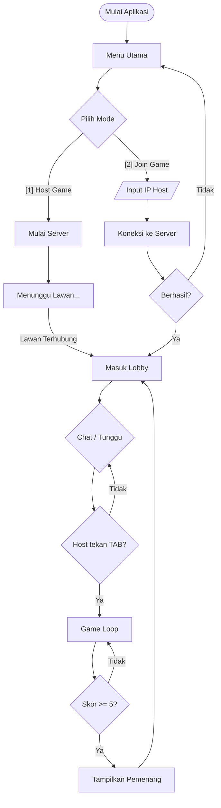
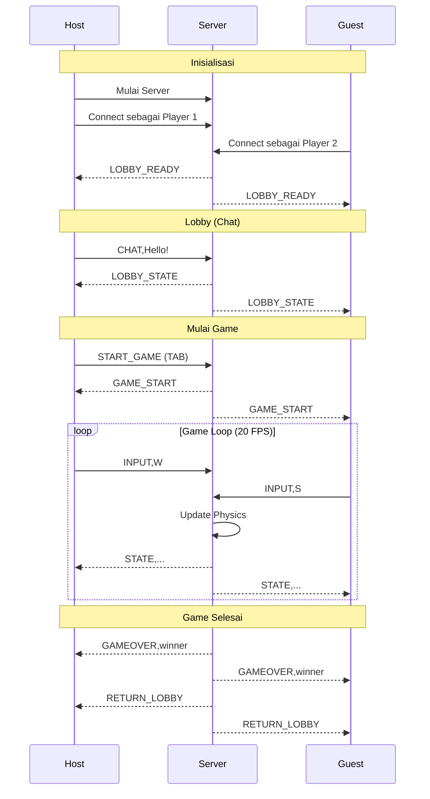

# Terminal Pong - Game Multiplayer CLI

Sebuah permainan Pong multiplayer waktu nyata (real-time) yang berjalan sepenuhnya di terminal menggunakan grafis ASCII. Proyek ini mendemonstrasikan konsep pemrograman jaringan menggunakan pustaka standar Python, menerapkan arsitektur Host-Client melalui soket TCP.

## Fitur

- **Multiplayer Real-time**: Dua pemain dapat bermain melawan satu sama lain melalui Jaringan Area Lokal (LAN).
- **Chat Lobby**: Pemain dapat berinteraksi via chat sebelum dan sesudah permainan.
- **Antarmuka CLI**: Menggunakan karakter ASCII untuk merender papan permainan, pemukul (paddle), dan bola.
- **Lintas Platform**: Berjalan di sistem Linux dan Windows dengan penanganan input spesifik platform.
- **Tanpa Ketergantungan Eksternal**: Dibangun hanya menggunakan pustaka standar Python (socket, threading, dll.).

## Persyaratan

- Python 3.6 atau lebih baru
- Jendela terminal atau command prompt
- Koneksi jaringan (Wi-Fi/LAN) untuk mode multiplayer

## Struktur Proyek

```
pong-cli/
├── main.py           # Entry point
├── config.py         # Konstanta dan konfigurasi
├── input_handler.py  # Penanganan input keyboard
├── game_state.py     # GameState & LobbyState
├── renderer.py       # Rendering ASCII
├── physics.py        # Fisika permainan
├── server.py         # GameServer class
└── client.py         # GameClient class
```

## Cara Bermain

### 1. Memulai Host (Pemain 1)

Host bertindak sebagai server permainan sekaligus pemain pertama (pemukul kiri).

1. Buka terminal.
2. Jalankan permainan:
   ```bash
   python3 main.py
   ```
3. Pilih opsi **[1] Host Game**.
4. Server akan mulai dan menampilkan Alamat IP Anda.
5. Tunggu pemain kedua terhubung.
6. Di **Lobby**, tekan **TAB** untuk memulai permainan.

### 2. Bergabung ke Permainan (Pemain 2)

1. Buka terminal di perangkat kedua.
2. Jalankan permainan:
   ```bash
   python3 main.py
   ```
3. Pilih opsi **[2] Join Game**.
4. Masukkan **Alamat IP Host**.
5. Tunggu host memulai permainan.

### Kontrol

| Lokasi | Tombol | Aksi |
|--------|--------|------|
| Lobby | Ketik + ENTER | Kirim pesan chat |
| Lobby | TAB | Mulai permainan (Host saja) |
| Lobby | Q | Keluar |
| Game | W | Gerakkan pemukul ke atas |
| Game | S | Gerakkan pemukul ke bawah |

### Aturan

- Bola bergerak secara otomatis.
- Pukul bola dengan pemukul Anda untuk memantulkannya kembali.
- Jika bola melewati pemukul Anda, lawan mencetak poin.
- Pemain pertama yang mencapai **5 poin** memenangkan permainan.
- Setelah permainan selesai, hasil ditampilkan di lobby.

## Arsitektur Teknis

- **Komunikasi**: Soket TCP (Port 5555).
- **Konkurensi**: Threading untuk komunikasi jaringan, fisika permainan, dan input.
- **Protokol**: Format string sederhana (CSV-like).
  - Client mengirim input: `INPUT,W` atau `INPUT,S`
  - Client mengirim chat: `CHAT,pesan`
  - Server menyiarkan status: `STATE,ball_x,ball_y,paddle1,paddle2,score1,score2`
  - Server menyiarkan lobby: `LOBBY_STATE,p1,p2,winner,score1,score2,chat`

## Diagram Alur (Flowchart)



## Diagram Urutan (Sequence Diagram)



## Penulis

Proyek Tugas Besar Network Programming  
Dibuat menggunakan Python Standard Library.
