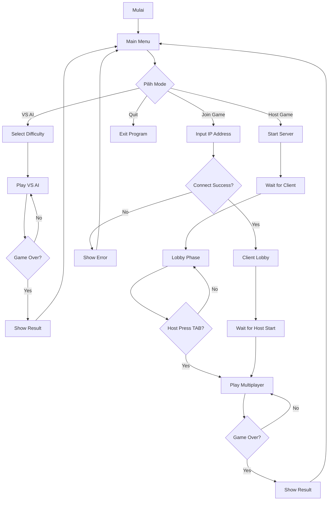
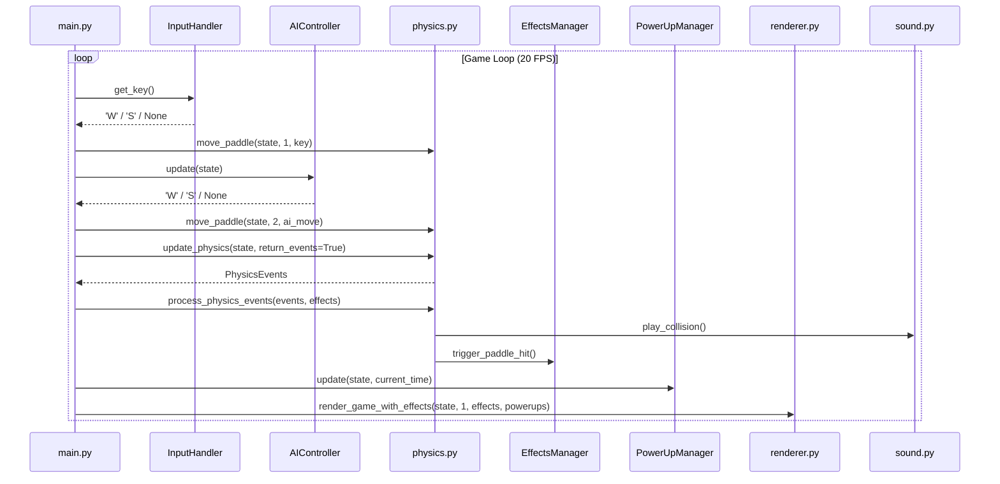
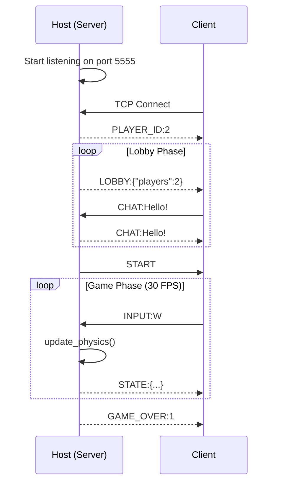
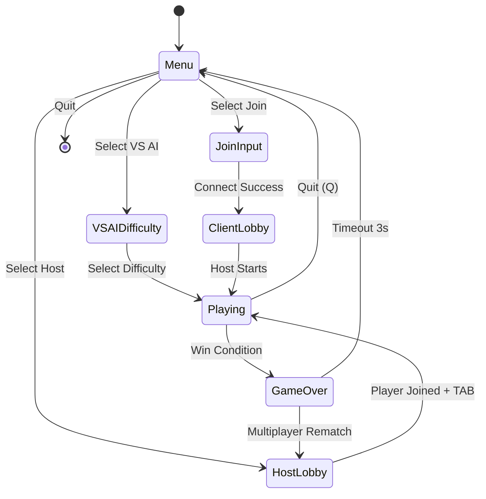

# Dokumen Desain

---

<div align="center">

## **PONG-CLI**
### Game Multiplayer Terminal Berbasis Network Programming

---

**Nama Mahasiswa:** Raditya Rizki Raharja

**Nama Dosen Pengampu:** M. Yusril Helmi Setyawan, S.Kom., M.Kom.,SFPC

**Mata Kuliah:** Network Programming

---

</div>

---

## Daftar Isi

1. [Deskripsi Aplikasi](#1-deskripsi-aplikasi)
2. [Fitur-fitur](#2-fitur-fitur)
3. [Workflow](#3-workflow)
4. [Narasi Pelengkap](#4-narasi-pelengkap)
5. [Kesimpulan](#5-kesimpulan)

---

## 1. Deskripsi Aplikasi

**PONG-CLI** adalah game Pong klasik yang diimplementasikan sepenuhnya di terminal menggunakan grafis ASCII/Unicode. Aplikasi ini menghadirkan gameplay arcade retro dengan dukungan **Multiplayer Real-time** melalui jaringan lokal (LAN) menggunakan protokol TCP, serta mode **Single Player VS AI**.

### Latar Belakang

Proyek ini dikembangkan sebagai Tugas Besar mata kuliah Network Programming dengan tujuan mengimplementasikan:

- **Socket Programming TCP** untuk komunikasi client-server
- **Arsitektur Client-Server** untuk multiplayer real-time
- **State Synchronization** antara host dan client
- **Non-blocking I/O** untuk responsif gameplay

### Teknologi yang Digunakan

| Komponen | Teknologi |
|----------|-----------|
| **Bahasa** | Python 3.6+ |
| **Networking** | Socket TCP (Python `socket` library) |
| **UI/Render** | ANSI Escape Codes, pyfiglet |
| **Audio** | ffplay/mpv (opsional) |
| **Architecture** | Client-Server, MVC Pattern |

---

## 2. Fitur-fitur

### 2.1 Multiplayer LAN (Host-Client)

Dua pemain dapat bermain secara real-time di jaringan lokal menggunakan arsitektur Host-Client:

- **Host Mode**: Menjalankan server TCP pada port 5555, mengelola game state, dan broadcast ke client
- **Join Mode**: Menghubungkan ke server host via IP address
- **Chat Lobby**: Sistem lobby interaktif dengan fitur chat sebelum game dimulai
- **State Sync**: Sinkronisasi posisi paddle, bola, dan skor pada 30 FPS

```
┌─────────────────┐         TCP          ┌─────────────────┐
│      HOST       │◄───────────────────►│     CLIENT      │
│  (Server +      │    Port 5555        │   (Receiver +   │
│   Player 1)     │                     │    Player 2)    │
└─────────────────┘                     └─────────────────┘
```

### 2.2 VS AI (Single Player)

Bermain melawan komputer dengan 3 tingkat kesulitan:

| Difficulty | Reaction Time | Accuracy | Karakteristik |
|------------|---------------|----------|---------------|
| **Easy** | Lambat (0.8s) | 50% | Sering meleset, pemula-friendly |
| **Medium** | Normal (0.4s) | 70% | Tantangan seimbang |
| **Hard** | Cepat (0.15s) | 95% | Sangat responsif dan akurat |

### 2.3 Sistem Power-ups

Power-ups muncul secara acak di arena dan memberikan efek sementara (5 detik):

| Simbol | Nama | Efek |
|--------|------|------|
| **S** | Speed+ | Mempercepat bola 1.5x |
| **+** | Paddle+ | Memperbesar paddle pemain |
| **-** | Paddle- | Memperkecil paddle lawan |

### 2.4 Efek Visual

- **Ball Trail**: Jejak bola yang memudar untuk kesan kecepatan
- **Goal Explosion**: Animasi ledakan partikel (★) saat gol
- **Paddle Hit Flash**: Efek kilat saat paddle memukul bola
- **Ball Warning**: Bola berubah merah saat mendekati gol

### 2.5 Sound Effects

Efek suara collision menggunakan file audio `sfx.mp3` yang dimainkan melalui:
- ffplay (cross-platform)
- mpv (Linux)
- paplay (PulseAudio)

### 2.6 UI Responsif

- Menu ASCII art menggunakan pyfiglet
- Box drawing dengan Unicode characters
- Color scheme ANSI untuk tampilan menarik
- Adaptif terhadap ukuran terminal

---

## 3. Workflow

### 3.1 Alur Kerja Umum (Flowchart)



### 3.2 Sequence Diagram: VS AI Game Loop



### 3.3 Sequence Diagram: Multiplayer Network Flow



### 3.4 State Diagram: Game States



### 3.5 Alur Data (Data Flow)

```
┌──────────────────────────────────────────────────────────┐
│                      INPUT LAYER                         │
│  ┌────────────────┐  ┌────────────────┐                 │
│  │ Keyboard Input │  │ Network Input  │                 │
│  │ (InputHandler) │  │ (Client recv)  │                 │
│  └───────┬────────┘  └───────┬────────┘                 │
└──────────┼───────────────────┼──────────────────────────┘
           │                   │
           ▼                   ▼
┌──────────────────────────────────────────────────────────┐
│                     LOGIC LAYER                          │
│  ┌─────────┐  ┌─────────┐  ┌─────────┐  ┌─────────┐    │
│  │ Physics │  │   AI    │  │PowerUps │  │ Effects │    │
│  └────┬────┘  └────┬────┘  └────┬────┘  └────┬────┘    │
│       │            │            │            │          │
│       └────────────┴────────────┴────────────┘          │
│                         │                               │
│                         ▼                               │
│                   ┌───────────┐                         │
│                   │ GameState │                         │
│                   └─────┬─────┘                         │
└─────────────────────────┼───────────────────────────────┘
                          │
                          ▼
┌──────────────────────────────────────────────────────────┐
│                     OUTPUT LAYER                         │
│  ┌────────────────┐  ┌────────────────┐  ┌──────────┐  │
│  │    Renderer    │  │ Network Send   │  │  Sound   │  │
│  │   (Terminal)   │  │ (Server send)  │  │  Player  │  │
│  └────────────────┘  └────────────────┘  └──────────┘  │
└──────────────────────────────────────────────────────────┘
```

### 3.6 Protokol Jaringan

**Spesifikasi TCP Connection:**
- Port: 5555 (configurable)
- Buffer Size: 2048 bytes
- Encoding: UTF-8
- Delimiter: Newline (`\n`)

**Message Format:**
```
TYPE:DATA\n
```

**Message Types:**

| Type | Direction | Data | Deskripsi |
|------|-----------|------|-----------|
| `PLAYER_ID` | S→C | `1` atau `2` | Assign player ID |
| `STATE` | S→C | JSON GameState | Update game state |
| `LOBBY` | S→C | JSON LobbyState | Update lobby state |
| `INPUT` | C→S | `W`, `S`, `Q` | Player input |
| `CHAT` | C↔S | String message | Chat message |
| `START` | S→C | - | Game dimulai |
| `GAME_OVER` | S→C | Winner ID | Game selesai |

### 3.7 Struktur Modul dan Dependencies

```
main.py                    # Entry point & Menu handler
├── config.py              # Konstanta & konfigurasi game
├── colors.py              # ANSI color utilities
├── ui_components.py       # Komponen UI reusable
│   └── pyfiglet           # ASCII art generator
├── input_handler.py       # Non-blocking keyboard input
├── game_state.py          # State management (Model)
├── physics.py             # Fisika bola & collision
│   └── sound.py           # Sound effects player
├── renderer.py            # ASCII renderer (View)
│   ├── colors.py
│   └── ui_components.py
├── ai.py                  # AI opponent controller
├── powerups.py            # Power-up system
├── effects.py             # Visual effects
├── server.py              # TCP game server
│   ├── game_state.py
│   └── physics.py
└── client.py              # TCP game client
    └── game_state.py
```

---

## 4. Narasi Pelengkap

### 4.1 Arsitektur MVC

Aplikasi menggunakan pattern **Model-View-Controller** yang dimodifikasi:

- **Model**: `GameState` menyimpan seluruh state permainan (posisi paddle, bola, skor)
- **View**: `renderer.py` menangani rendering ASCII ke terminal
- **Controller**: `main.py`, `physics.py`, `ai.py` menangani logika permainan

### 4.2 Konsep Network Programming yang Diterapkan

1. **Socket Programming**: Menggunakan `socket.socket(AF_INET, SOCK_STREAM)` untuk koneksi TCP
2. **Client-Server Architecture**: Host bertindak sebagai server authoritative
3. **State Serialization**: GameState di-serialize ke JSON untuk transmisi
4. **Non-blocking I/O**: Input handler dan network receiver menggunakan threading

### 4.3 Optimisasi Performance

| Komponen | Target | Actual |
|----------|--------|--------|
| Frame Rate | 20 FPS | ~20 FPS |
| Network Latency | <50ms | LAN: ~5ms |
| Input Latency | <16ms | ~10ms |
| Render Time | <10ms | ~5ms |

---

## 5. Kesimpulan

### 5.1 Hasil Uji Aplikasi

#### A. Pengujian Fungsional

| Test Case | Hasil | Keterangan |
|-----------|-------|------------|
| Menu navigasi W/S/Enter | ✅ Pass | Navigasi responsif |
| VS AI - Easy | ✅ Pass | AI dapat dikalahkan |
| VS AI - Medium | ✅ Pass | Tantangan seimbang |
| VS AI - Hard | ✅ Pass | AI sangat kompetitif |
| Host Game | ✅ Pass | Server berjalan pada port 5555 |
| Join Game | ✅ Pass | Client berhasil terhubung |
| Multiplayer sync | ✅ Pass | State tersinkronisasi real-time |
| Power-ups spawn | ✅ Pass | Muncul setiap 10 detik |
| Power-ups effect | ✅ Pass | Efek 5 detik bekerja |
| Visual effects | ✅ Pass | Trail, explosion, flash bekerja |
| Sound effects | ✅ Pass | Collision sound terdengar |

#### B. Pengujian Jaringan

| Skenario | Hasil | Latency |
|----------|-------|---------|
| LAN - Same Router | ✅ Pass | ~5ms |
| localhost (127.0.0.1) | ✅ Pass | <1ms |
| Reconnection | ✅ Pass | Server menangani disconnect |

#### C. Compile Check

```bash
$ python3 -m py_compile *.py
# No errors - All modules compile successfully
```

### 5.2 Manfaat Aplikasi di Dunia Nyata

#### A. Edukasi Network Programming

- **Pembelajaran Socket**: Implementasi nyata TCP socket programming
- **Client-Server Model**: Memahami arsitektur distributed system
- **Real-time Sync**: Konsep state synchronization dan latency management
- **Protocol Design**: Merancang message format untuk komunikasi

#### B. Pengembangan Skill

- **Python Advanced**: Threading, non-blocking I/O, OOP
- **Game Development**: Game loop, physics, collision detection
- **UI/UX Terminal**: ANSI escape codes, ASCII art
- **Software Architecture**: MVC pattern, modular design

#### C. Portabilitas dan Aksesibilitas

- **Cross-platform**: Berjalan di Linux, Windows, macOS
- **Minimal Dependencies**: Hanya Python 3.6+ standard library
- **Low Resource**: Tidak memerlukan GPU atau grafis berat
- **SSH Playable**: Dapat dimainkan via SSH remote session

#### D. Fondasi untuk Pengembangan Lanjut

Proyek ini dapat dikembangkan lebih lanjut untuk:
- Tournament system dengan bracket
- Spectator mode
- Custom power-ups
- Different game modes (time attack, survival)
- Leaderboard dengan database

---

*Dokumen ini disusun sebagai bagian dari Tugas Besar Network Programming.*

---
