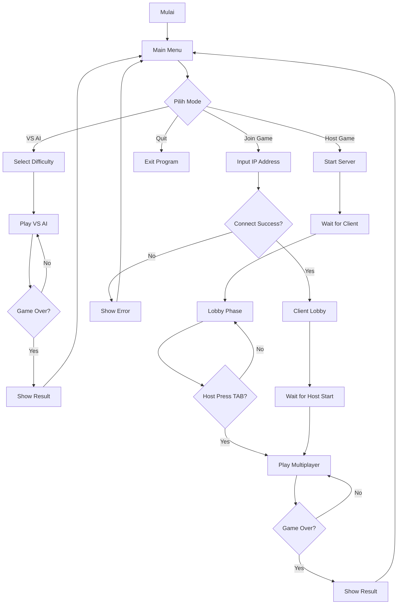
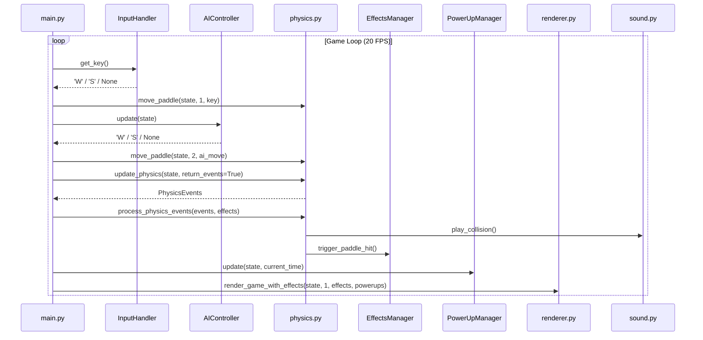
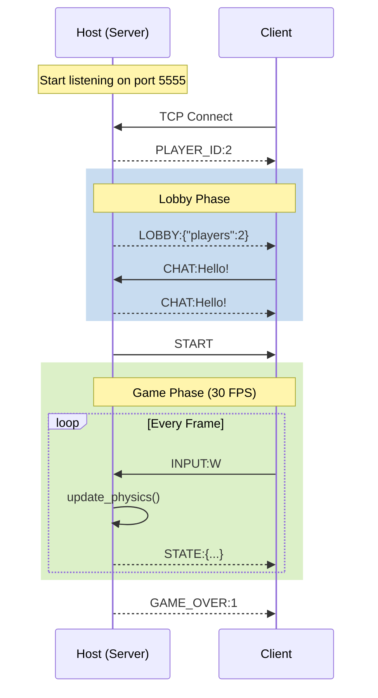
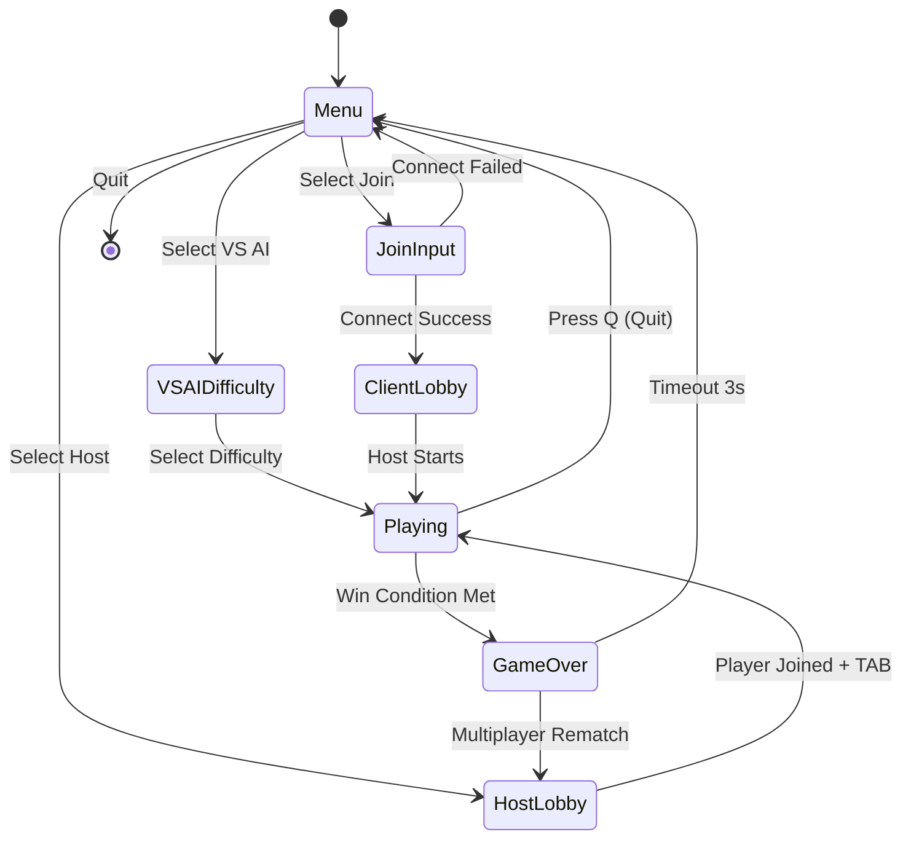

<div align="center">
<h1 style="font-family: Arial; font-size: 18pt;"><b>DOKUMEN DESAIN</b></h1>

---

<h2 style="font-family: Arial; font-size: 16pt;"><b>PONG-CLI</b></h2>
<h3>Game Multiplayer Terminal Berbasis Network Programming</h3>

---

**Nama Mahasiswa:** Raditya Rizki Raharja

**Dosen Pengampu:** M. Yusril Helmi Setyawan, S.Kom., M.Kom., SFPC

---

<sub>Tugas Besar Network Programming 2025</sub>

</div>

---

## Daftar Isi

1. [Deskripsi](#1-deskripsi)
2. [Fitur-fitur](#2-fitur-fitur)
3. [Workflow](#3-workflow)
4. [Tampilan UI Aplikasi](#4-tampilan-ui-aplikasi)
5. [Panduan Penggunaan Aplikasi](#5-panduan-penggunaan-aplikasi)
6. [Narasi Pelengkap](#6-narasi-pelengkap)
7. [Kesimpulan](#7-kesimpulan)

---

## 1. Deskripsi

**PONG-CLI** merupakan sebuah aplikasi permainan yang terinspirasi dari game arcade klasik Pong, yang dikembangkan untuk berjalan sepenuhnya di dalam lingkungan terminal. Berbeda dengan implementasi Pong pada umumnya yang menggunakan antarmuka grafis modern, aplikasi ini memanfaatkan karakter-karakter ASCII dan Unicode untuk merender seluruh elemen visual permainan, mulai dari paddle, bola, hingga efek-efek animasi yang memperkaya pengalaman bermain.

Keunikan utama dari aplikasi ini terletak pada kemampuannya untuk mendukung permainan **Multiplayer secara Real-time** melalui jaringan lokal (Local Area Network/LAN). Dengan memanfaatkan protokol TCP (Transmission Control Protocol), dua pemain yang berada pada perangkat berbeda namun terhubung dalam satu jaringan dapat bermain bersama dengan latensi minimal. Selain mode multiplayer, aplikasi ini juga menyediakan mode **Single Player VS AI** yang memungkinkan pengguna berlatih melawan komputer dengan berbagai tingkat kesulitan.

### Latar Belakang

Proyek PONG-CLI dikembangkan sebagai Tugas Besar mata kuliah Network Programming dengan tujuan utama memberikan implementasi praktis dari berbagai konsep jaringan komputer yang telah dipelajari secara teoritis. Melalui pengembangan aplikasi ini, mahasiswa dapat memahami secara mendalam bagaimana sebuah aplikasi multiplayer real-time bekerja di balik layar.

Beberapa konsep utama Network Programming yang diimplementasikan dalam proyek ini meliputi:

- **Socket Programming TCP**: Aplikasi menggunakan socket TCP untuk membangun koneksi yang reliable antara host (server) dan client. Protokol TCP dipilih karena menjamin pengiriman data secara berurutan dan tanpa kehilangan, yang sangat penting untuk sinkronisasi state permainan.

- **Arsitektur Client-Server**: Dalam mode multiplayer, salah satu pemain bertindak sebagai host yang menjalankan server game, sementara pemain lainnya terhubung sebagai client. Server bertanggung jawab mengelola seluruh logika permainan dan menyiarkan (broadcast) state terbaru ke semua client yang terhubung.

- **State Synchronization**: Untuk memastikan kedua pemain melihat kondisi permainan yang identik, aplikasi menerapkan mekanisme sinkronisasi state. Server mengirimkan data posisi paddle, bola, dan skor kepada client sebanyak 30 kali per detik (30 FPS), sehingga pergerakan terasa smooth dan konsisten.

- **Non-blocking I/O**: Input dari keyboard dan pesan dari jaringan diproses secara asinkron menggunakan threading, sehingga aplikasi tetap responsif meskipun sedang menunggu data dari jaringan atau input dari pengguna.

### Teknologi yang Digunakan

Pengembangan aplikasi PONG-CLI memanfaatkan berbagai teknologi dan library yang dipilih berdasarkan kebutuhan spesifik proyek:

| Komponen | Teknologi | Penjelasan |
|----------|-----------|------------|
| **Bahasa Pemrograman** | Python 3.6+ | Dipilih karena sintaksnya yang mudah dipahami, dukungan built-in untuk socket programming, serta library standar yang lengkap |
| **Networking** | Socket TCP | Menggunakan library `socket` bawaan Python untuk koneksi jaringan yang reliable |
| **User Interface** | ANSI Escape Codes, pyfiglet | ANSI codes digunakan untuk pewarnaan dan positioning cursor, sedangkan pyfiglet menghasilkan ASCII art untuk judul |
| **Audio** | ffplay/mpv/paplay | Player audio eksternal yang dijalankan sebagai subprocess untuk efek suara collision |
| **Arsitektur** | Client-Server, MVC | Pemisahan tanggung jawab antara Model (data), View (tampilan), dan Controller (logika) |

---

## 2. Fitur-fitur

Aplikasi PONG-CLI dilengkapi dengan berbagai fitur yang dirancang untuk memberikan pengalaman bermain yang lengkap dan menarik. Berikut adalah penjelasan detail mengenai setiap fitur yang tersedia:

### 2.1 Multiplayer LAN (Host-Client)

Fitur unggulan dari PONG-CLI adalah kemampuan untuk bermain secara multiplayer melalui jaringan lokal. Sistem ini mengadopsi arsitektur Host-Client di mana salah satu pemain menjalankan server game (sebagai Host), dan pemain lainnya bergabung sebagai Client.

Ketika pemain memilih untuk menjadi Host, aplikasi akan membuka koneksi TCP pada port 5555 dan menampilkan alamat IP lokal yang dapat digunakan oleh pemain lain untuk bergabung. Setelah Client terhubung, kedua pemain akan masuk ke dalam ruang tunggu (lobby) di mana mereka dapat saling berkirim pesan melalui fitur chat bawaan. Permainan baru dimulai ketika Host menekan tombol TAB.

Selama permainan berlangsung, Host bertanggung jawab untuk menjalankan seluruh logika game termasuk perhitungan fisika bola dan deteksi collision. State permainan kemudian disiarkan ke Client dengan frekuensi 30 frame per detik, memastikan kedua pemain melihat kondisi permainan yang sama secara real-time.

```
┌─────────────────┐         TCP          ┌─────────────────┐
│      HOST       │◄───────────────────►│     CLIENT      │
│  (Server +      │    Port 5555        │   (Receiver +   │
│   Player 1)     │                     │    Player 2)    │
└─────────────────┘                     └─────────────────┘
```

### 2.2 VS AI (Single Player)

Bagi pemain yang ingin berlatih atau bermain sendiri, PONG-CLI menyediakan mode VS AI yang memungkinkan pertandingan melawan komputer. AI dalam game ini diimplementasikan dengan sistem kesulitan bertahap yang dapat disesuaikan dengan kemampuan pemain.

Terdapat tiga tingkat kesulitan yang tersedia, masing-masing dengan karakteristik yang berbeda:

| Difficulty | Reaction Time | Accuracy | Karakteristik |
|------------|---------------|----------|---------------|
| **Easy** | Lambat (0.8s) | 50% | AI pada level ini dirancang untuk pemain pemula. Dengan waktu reaksi yang lambat dan akurasi hanya 50%, AI sering meleset dalam mengantisipasi bola, memberikan kesempatan besar bagi pemain untuk mencetak poin. |
| **Medium** | Normal (0.4s) | 70% | Tingkat kesulitan menengah memberikan tantangan yang seimbang. AI bergerak dengan kecepatan wajar dan mampu menghalau sebagian besar serangan, namun masih bisa dikalahkan dengan strategi yang tepat. |
| **Hard** | Cepat (0.15s) | 95% | Level tertinggi menghadirkan AI yang sangat kompetitif. Dengan waktu reaksi sangat cepat dan akurasi mencapai 95%, pemain harus benar-benar fokus dan menggunakan teknik-teknik advanced untuk memenangkan pertandingan. |

### 2.3 Sistem Power-ups

Untuk menambah dinamika dan keseruan permainan, PONG-CLI mengimplementasikan sistem power-ups yang muncul secara acak di arena. Setiap 10 detik, sebuah power-up akan muncul di area permainan dan dapat diambil oleh siapa pun yang bolanya menyentuh power-up tersebut.

Terdapat tiga jenis power-up dengan efek yang berbeda-beda:

| Simbol | Nama | Efek |
|--------|------|------|
| **S** | Speed+ | Power-up ini meningkatkan kecepatan bola menjadi 1.5 kali lipat dari kecepatan normal. Efek ini dapat menguntungkan atau merugikan, tergantung situasi permainan. |
| **+** | Paddle+ | Memperbesar ukuran paddle pemain yang mengambil sebanyak 2 unit, memudahkan untuk menghalau bola. |
| **-** | Paddle- | Memperkecil paddle lawan sebanyak 2 unit, mempersulit lawan dalam menghalau serangan. |

Semua efek power-up bersifat sementara dan akan berakhir setelah 5 detik. Informasi power-up yang sedang aktif ditampilkan pada bagian atas layar permainan.

### 2.4 Efek Visual

PONG-CLI tidak hanya sekedar game terminal biasa, tetapi dilengkapi dengan berbagai efek visual ASCII yang memberikan feedback visual menarik kepada pemain:

- **Ball Trail**: Setiap pergerakan bola meninggalkan jejak yang secara gradual memudar, menciptakan kesan kecepatan. Jejak ini dirender menggunakan karakter Unicode dengan intensitas berbeda (`●` → `◉` → `○` → `◦` → `·`).

- **Goal Explosion**: Ketika gol tercipta, sebuah animasi ledakan partikel berbentuk bintang (`★`) muncul di posisi bola memasuki gawang. Animasi ini terdiri dari beberapa frame yang memberikan kesan celebratory.

- **Paddle Hit Flash**: Setiap kali bola mengenai paddle, efek kilat singkat ditampilkan menggunakan karakter Unicode block (`█` → `▓` → `▒` → `░`) yang memberikan feedback visual bahwa kontak telah terjadi.

- **Goal Celebration**: Teks "★★★ GOAL! ★★★" muncul dengan animasi expanding-contracting untuk merayakan setiap gol yang tercipta.

### 2.5 Sound Effects

Untuk melengkapi pengalaman bermain, PONG-CLI mendukung efek suara yang dimainkan ketika terjadi collision. File audio `sfx.mp3` digunakan sebagai sumber suara dan dimainkan menggunakan player eksternal.

Aplikasi secara otomatis mendeteksi player audio yang tersedia di sistem dan menggunakannya untuk memainkan suara. Player yang didukung meliputi ffplay (cross-platform), mpv (Linux/macOS), dan paplay untuk sistem yang menggunakan PulseAudio. Jika tidak ada player yang terdeteksi, game tetap berjalan dengan normal tanpa suara.

### 2.6 UI Responsif

Antarmuka pengguna PONG-CLI dirancang dengan memperhatikan estetika dan fungsionalitas terminal:

- **ASCII Art Header**: Menu utama menampilkan judul "PONG" dalam format ASCII art besar yang dihasilkan menggunakan library pyfiglet, memberikan kesan retro arcade.

- **Box Drawing**: Seluruh elemen UI menggunakan karakter Unicode box drawing (`╭`, `╮`, `│`, `═`, dll.) untuk menciptakan batas-batas yang rapi dan modern.

- **Color Scheme**: Aplikasi memanfaatkan ANSI escape codes untuk menampilkan warna-warna seperti cyan untuk header, yellow untuk highlight, green untuk status sukses, dan red untuk warning.

- **Adaptif Terminal**: Tampilan game menyesuaikan dengan ukuran terminal, memastikan pengalaman yang optimal pada berbagai resolusi.

---

## 3. Workflow

Bagian ini menjelaskan secara visual dan naratif bagaimana alur kerja aplikasi PONG-CLI dari awal hingga akhir. Berbagai diagram disajikan untuk memberikan pemahaman komprehensif tentang proses-proses yang terjadi, baik dari perspektif pengguna maupun teknis internal sistem.

### 3.1 Alur Kerja Umum (Flowchart)

Diagram berikut menggambarkan alur utama aplikasi PONG-CLI dari saat pengguna menjalankan program hingga selesai bermain. Terdapat tiga jalur utama yang dapat dipilih pengguna: bermain melawan AI, menjadi host multiplayer, atau bergabung ke game multiplayer sebagai client.



**Penjelasan Alur:**

Saat pengguna pertama kali menjalankan `python main.py`, aplikasi akan membersihkan layar terminal dan menampilkan **Main Menu** dengan empat opsi pilihan. Pengguna dapat menavigasi menggunakan tombol W (atas) dan S (bawah), kemudian Enter untuk memilih.

Jika pengguna memilih **VS AI**, aplikasi akan menampilkan menu pemilihan tingkat kesulitan. Setelah difficulty dipilih, game loop dimulai dan akan terus berjalan hingga salah satu pemain mencapai skor kemenangan. Layar hasil ditampilkan selama 3 detik sebelum kembali ke menu utama.

Jika pengguna memilih **Host Game**, aplikasi akan memulai TCP server pada port 5555 dan menampilkan alamat IP lokal. Aplikasi kemudian menunggu hingga client terhubung. Setelah terkoneksi, kedua pemain masuk ke **Lobby Phase** di mana mereka dapat bertukar pesan chat. Host dapat menekan TAB kapan saja untuk memulai permainan. Setelah game selesai, hasil ditampilkan dan pemain kembali ke menu.

Jika pengguna memilih **Join Game**, aplikasi akan meminta input alamat IP host. Jika koneksi berhasil, client masuk ke lobby dan menunggu hingga host memulai permainan. Jika koneksi gagal, pesan error ditampilkan dan pengguna kembali ke menu.

### 3.2 Sequence Diagram: VS AI Game Loop

Diagram berikut menunjukkan interaksi antar modul dalam satu frame game loop (20 FPS):



**Penjelasan Alur:**

Setiap frame dalam game loop VS AI terdiri dari beberapa tahap yang dieksekusi secara berurutan. Pertama, **InputHandler** memeriksa apakah ada input keyboard dari pemain (tombol W atau S). Input ini kemudian diteruskan ke modul **Physics** untuk menggerakkan paddle pemain.

Selanjutnya, **AIController** menganalisis posisi bola saat ini dan menentukan gerakan paddle AI. Keputusan AI didasarkan pada parameter difficulty yang telah dipilih (reaction time dan accuracy). Hasil keputusan AI juga diteruskan ke Physics untuk menggerakkan paddle AI.

Setelah kedua paddle diperbarui, modul **Physics** menjalankan `update_physics()` yang menghitung posisi baru bola, mendeteksi collision dengan dinding dan paddle, serta memeriksa kondisi gol. Fungsi ini mengembalikan object **PhysicsEvents** yang berisi informasi tentang event-event yang terjadi.

PhysicsEvents kemudian diproses untuk memicu efek-efek yang sesuai. Jika terjadi collision, modul **Sound** memutar suara, dan **EffectsManager** menampilkan efek visual seperti paddle flash atau goal explosion.

Paralel dengan proses di atas, **PowerUpManager** memeriksa apakah ada power-up yang perlu di-spawn atau di-collect, serta mengelola durasi efek power-up yang sedang aktif.

Terakhir, **Renderer** mengambil state game terbaru dan merender seluruh elemen ke terminal, termasuk paddle, bola, skor, power-up, dan efek visual.

### 3.3 Sequence Diagram: Multiplayer Network Flow

Alur komunikasi TCP antara Host (Server) dan Client:



**Penjelasan Alur:**

Komunikasi multiplayer dimulai ketika Host memulai server TCP yang mendengarkan koneksi pada port 5555. Ketika Client mencoba terhubung menggunakan alamat IP host, koneksi TCP three-way handshake dilakukan secara otomatis oleh sistem operasi.

Segera setelah koneksi berhasil, Host mengirimkan pesan **PLAYER_ID:2** untuk memberitahu Client bahwa mereka adalah Player 2 (Host selalu menjadi Player 1). Ini penting agar kedua sisi mengetahui perspektif masing-masing dalam game.

Selama **Lobby Phase**, Host secara periodik mengirimkan pesan **LOBBY** yang berisi jumlah pemain terhubung dan status koneksi. Kedua pemain dapat bertukar pesan chat yang di-broadcast oleh server ke semua client yang terhubung.

Ketika Host menekan TAB untuk memulai permainan, pesan **START** dikirim ke Client. Ini menandai transisi dari Lobby Phase ke Game Phase.

Selama **Game Phase**, komunikasi menjadi lebih intensif. Client mengirimkan input keyboard (W/S) ke Host setiap kali ada penekanan tombol. Host menjalankan logika game (physics, collision, scoring) dan menyiarkan pesan **STATE** yang berisi seluruh game state dalam format JSON. State ini dikirim 30 kali per detik (30 FPS) untuk memastikan kedua pemain melihat kondisi yang sama.

Ketika kondisi kemenangan tercapai (salah satu pemain mencapai skor target), Host mengirimkan pesan **GAME_OVER** beserta ID pemain pemenang.

### 3.4 State Diagram

Transisi state dalam aplikasi:



**Penjelasan State:**

Aplikasi PONG-CLI memiliki beberapa state utama yang mengelola lifecycle permainan:

- **Menu**: State awal ketika aplikasi dijalankan. Dari sini, pengguna dapat memilih mode permainan atau keluar.

- **VSAIDifficulty**: State pemilihan tingkat kesulitan AI. State ini hanya dilalui jika pengguna memilih mode VS AI.

- **HostLobby**: State lobby untuk host yang menunggu client terhubung. Host dapat melihat status koneksi dan memulai chat.

- **JoinInput**: State untuk memasukkan alamat IP host. Jika koneksi gagal, pengguna kembali ke Menu.

- **ClientLobby**: State lobby untuk client yang sudah terhubung. Client menunggu host memulai permainan.

- **Playing**: State aktif permainan. Baik mode VS AI maupun Multiplayer menggunakan state ini. Pemain dapat keluar kapan saja dengan menekan Q.

- **GameOver**: State akhir permainan yang menampilkan hasil. State ini berlangsung selama 3 detik sebelum transisi ke Menu (atau HostLobby untuk rematch multiplayer).

### 3.5 Alur Data (Data Flow Diagram)

```
┌──────────────────────────────────────────────────────────────────┐
│                         INPUT LAYER                              │
│  ┌─────────────────┐           ┌─────────────────┐               │
│  │  Keyboard Input │           │  Network Input  │               │
│  │  (InputHandler) │           │  (Client recv)  │               │
│  └────────┬────────┘           └────────┬────────┘               │
└───────────┼─────────────────────────────┼────────────────────────┘
            │                             │
            ▼                             ▼
┌──────────────────────────────────────────────────────────────────┐
│                         LOGIC LAYER                              │
│  ┌─────────┐  ┌─────────┐  ┌──────────┐  ┌──────────┐            │
│  │ Physics │  │   AI    │  │ PowerUps │  │ Effects  │            │
│  │  .py    │  │  .py    │  │   .py    │  │   .py    │            │
│  └────┬────┘  └────┬────┘  └────┬─────┘  └────┬─────┘            │
│       │            │            │             │                  │
│       └────────────┴─────┬──────┴─────────────┘                  │
│                          ▼                                       │
│                   ┌────────────┐                                 │
│                   │ GameState  │                                 │
│                   │ (Model)    │                                 │
│                   └──────┬─────┘                                 │
└──────────────────────────┼───────────────────────────────────────┘
                           │
                           ▼
┌──────────────────────────────────────────────────────────────────┐
│                        OUTPUT LAYER                              │
│  ┌─────────────────┐  ┌─────────────────┐  ┌─────────────────┐   │
│  │    Renderer     │  │  Network Send   │  │     Sound       │   │
│  │   (Terminal)    │  │  (Server send)  │  │    Player       │   │
│  └─────────────────┘  └─────────────────┘  └─────────────────┘   │
└──────────────────────────────────────────────────────────────────┘
```

**Penjelasan Alur Data:**

Arsitektur data PONG-CLI mengikuti pola **three-layer architecture** yang memisahkan input, logika, dan output:

**Input Layer** bertanggung jawab menerima masukan dari dua sumber. **Keyboard Input** melalui modul `InputHandler` menggunakan threading untuk membaca input secara non-blocking, sehingga game tidak terhenti menunggu input. **Network Input** diterima oleh Client dari Host melalui koneksi TCP, berisi update state game yang harus ditampilkan.

**Logic Layer** merupakan inti dari aplikasi. Berbagai modul bekerja sama untuk memproses input dan menghasilkan output. Modul **Physics** menghitung pergerakan bola dan mendeteksi collision. **AI** menganalisis state dan menghasilkan keputusan gerakan. **PowerUps** mengelola spawn dan efek power-up. **Effects** mengelola animasi visual. Semua modul ini membaca dan menulis ke **GameState** yang menjadi single source of truth untuk seluruh data permainan.

**Output Layer** mengambil data dari GameState dan menyajikannya ke pengguna. **Renderer** mengkonversi data menjadi tampilan ASCII di terminal. **Network Send** (untuk Host) menyiarkan state ke semua client yang terhubung. **Sound Player** memainkan efek suara berdasarkan event yang terjadi.

Alur data ini bersifat unidirectional: input mengalir ke logic, logic memperbarui state, dan output membaca dari state. Ini memastikan konsistensi data dan memudahkan debugging.

### 3.6 Protokol Jaringan

Komunikasi antara Host dan Client dalam PONG-CLI menggunakan protokol custom yang berjalan di atas TCP. Protokol ini dirancang dengan prinsip kesederhanaan dan efisiensi, menggunakan format text-based yang mudah diparsing.

**Spesifikasi TCP Connection:**

Koneksi TCP dikonfigurasi dengan parameter berikut untuk memastikan performa optimal dalam konteks game real-time:

| Parameter | Nilai | Penjelasan |
|-----------|-------|------------|
| Port | 5555 | Port default yang digunakan server, dapat dikonfigurasi melalui config.py |
| Buffer Size | 2048 bytes | Ukuran buffer untuk menerima data, cukup besar untuk menampung state game dalam format JSON |
| Encoding | UTF-8 | Encoding karakter yang mendukung Unicode untuk kompatibilitas lintas platform |
| Delimiter | Newline (`\n`) | Pemisah antar pesan untuk memudahkan parsing stream data |

**Message Format:**

Setiap pesan yang dikirim mengikuti format sederhana berupa pasangan TYPE dan DATA yang dipisahkan dengan titik dua:
```
TYPE:DATA\n
```

**Message Types:**

Tabel berikut menjelaskan berbagai jenis pesan yang digunakan dalam komunikasi Host-Client:

| Type | Direction | Data | Deskripsi |
|------|-----------|------|-----------|
| `PLAYER_ID` | Server → Client | `1` atau `2` | Dikirim segera setelah koneksi berhasil untuk memberitahu client nomor playernya |
| `STATE` | Server → Client | JSON GameState | Berisi seluruh state game (posisi bola, paddle, skor) yang dikirim setiap frame |
| `LOBBY` | Server → Client | JSON LobbyState | Informasi lobby termasuk jumlah pemain dan status koneksi |
| `INPUT` | Client → Server | `W`, `S`, `Q` | Input keyboard dari client yang dikirim ke server untuk diproses |
| `CHAT` | Bidirectional | String message | Pesan chat yang dapat dikirim oleh Host maupun Client |
| `START` | Server → Client | - | Sinyal bahwa Host telah memulai permainan |
| `GAME_OVER` | Server → Client | Winner ID | Dikirim saat kondisi kemenangan tercapai, berisi ID pemain pemenang |

---

## 4. Tampilan UI Aplikasi

Bagian ini menyajikan representasi visual dari berbagai layar yang akan ditemui pengguna saat menjalankan aplikasi PONG-CLI. Setiap tampilan dirender menggunakan karakter ASCII dan Unicode untuk menciptakan antarmuka yang estetis dalam lingkungan terminal.

### 4.1 Main Menu

Layar utama yang menyambut pengguna saat aplikasi pertama kali dijalankan. Menu menampilkan judul game dalam format ASCII art besar dan daftar opsi yang dapat dipilih menggunakan tombol navigasi:

```
╭──────────────────────────────────────────────╮
│                                              │
│   ██████╗  ██████╗ ███╗   ██╗ ██████╗        │
│   ██╔══██╗██╔═══██╗████╗  ██║██╔════╝        │
│   ██████╔╝██║   ██║██╔██╗ ██║██║  ███╗       │
│   ██╔═══╝ ██║   ██║██║╚██╗██║██║   ██║       │
│   ██║     ╚██████╔╝██║ ╚████║╚██████╔╝       │
│   ╚═╝      ╚═════╝ ╚═╝  ╚═══╝ ╚═════╝        │
│                                              │
│            ═══ MAIN MENU ═══                 │
│                                              │
│        ▸ Host Game      (Server)             │
│          Join Game      (Client)             │
│          VS AI          (Single Player)      │
│          Quit                                │
│                                              │
│         [W/S] Navigate   [Enter] Select      │
╰──────────────────────────────────────────────╯
```

Tampilan Main Menu menampilkan judul "PONG" dalam format ASCII art yang dibuat menggunakan library pyfiglet. Di bawah judul, terdapat empat opsi menu yang dapat dinavigasi dengan tombol W (atas) dan S (bawah). Opsi yang sedang dipilih ditandai dengan simbol panah (▸). Setiap opsi dilengkapi dengan keterangan singkat untuk membantu pengguna memahami fungsinya.

### 4.2 AI Difficulty Selection

```
╭──────────────────────────────────────────────╮
│                                              │
│            ═══ SELECT DIFFICULTY ═══         │
│                                              │
│        ▸ Easy       (Beginner Friendly)      │
│          Medium     (Balanced Challenge)     │
│          Hard       (Expert Level)           │
│                                              │
│         [W/S] Navigate   [Enter] Select      │
│                [Q] Back                      │
╰──────────────────────────────────────────────╯
```

Menu pemilihan tingkat kesulitan AI menampilkan tiga opsi dengan deskripsi karakteristik masing-masing. Pemain dapat memilih sesuai kemampuan: Easy untuk pemula, Medium untuk tantangan seimbang, dan Hard untuk pemain berpengalaman. Tombol Q memungkinkan kembali ke menu utama.

### 4.3 Multiplayer Lobby

```
╭──────────────────────────────────────────────────────────────────────╮
│                           GAME LOBBY                                 │
├──────────────────────────────────────────────────────────────────────┤
│                                                                      │
│  Server IP: 192.168.1.100:5555                                       │
│                                                                      │
│  Players:                                                            │
│    ● Player 1 (Host)     ✓ Ready                                     │
│    ● Player 2            ✓ Connected                                 │
│                                                                      │
├──────────────────────────────────────────────────────────────────────┤
│  Chat:                                                               │
│  ───────────────────────────────────────                             │
│  [Player 1]: Hello!                                                  │
│  [Player 2]: Ready to play?                                          │
│  [Player 1]: Let's go!                                               │
│                                                                      │
│  > Type message here...                                              │
├──────────────────────────────────────────────────────────────────────┤
│              [TAB] Start Game    [Q] Leave Lobby                     │
╰──────────────────────────────────────────────────────────────────────╯
```

Lobby multiplayer menampilkan informasi lengkap untuk koordinasi antar pemain. Di bagian atas terlihat alamat IP server yang dapat dibagikan ke pemain lain. Section Players menunjukkan status koneksi setiap pemain. Area chat memungkinkan komunikasi sebelum permainan dimulai. Host dapat memulai game dengan menekan TAB setelah semua pemain siap.

### 4.4 Gameplay Screen

```
╭──────────────────────────────────────────────────────────────────────╮
│   Player 1: 3                          Player 2: 2   [Speed+ Active] │
├──────────────────────────────────────────────────────────────────────┤
│  █                                                                 █ │
│  █                                                                 █ │
│  █                         ◦ · ●                                   █ │
│  █                                                                 █ │
│  █                                                                 █ │
│                                  +                                   │
│                              (Power-up)                              │
│                                                                      │
│  █                                                                 █ │
│  █                                                                 █ │
│  █                                                                 █ │
│  █                                                                 █ │
├──────────────────────────────────────────────────────────────────────┤
│                    [W] Up   [S] Down   [Q] Quit                      │
╰──────────────────────────────────────────────────────────────────────╯
```

Tampilan gameplay menampilkan arena permainan dengan dua paddle di sisi kiri dan kanan, serta bola yang bergerak di tengah. Skor masing-masing pemain ditampilkan di bagian atas. Jika ada power-up yang aktif, statusnya ditampilkan di pojok kanan atas (seperti "Speed+ Active"). Power-up yang belum diambil muncul sebagai simbol di tengah arena. Jejak bola (ball trail) terlihat sebagai karakter yang memudar (`●` → `·`).

### 4.5 Game Over Screen

```
╭──────────────────────────────────────────────╮
│                                              │
│            ★★★ GAME OVER ★★★                │
│                                              │
│               🏆 PLAYER 1 WINS! 🏆            │
│                                              │
│              Final Score: 5 - 3              │
│                                              │
│         Returning to menu in 3s...           │
│                                              │
╰──────────────────────────────────────────────╯
```

Layar Game Over menampilkan hasil akhir pertandingan dengan visual celebratory. Nama pemain pemenang ditampilkan dengan ikon trophy, diikuti skor akhir. Countdown 3 detik ditampilkan sebelum aplikasi otomatis kembali ke menu utama.

---

## 5. Panduan Penggunaan Aplikasi

Panduan ini memberikan instruksi lengkap untuk menginstal dan menggunakan aplikasi PONG-CLI. Setiap langkah dijelaskan secara detail untuk memastikan pengguna dapat memainkan game dengan lancar.

### 5.1 Persyaratan Sistem

Sebelum menjalankan PONG-CLI, pastikan sistem Anda memenuhi persyaratan minimum berikut:

| Komponen | Minimum | Keterangan |
|----------|---------|------------|
| Python | 3.6+ | Bahasa pemrograman utama, pastikan sudah terinstal dan dapat diakses melalui command line |
| Terminal | Mendukung ANSI escape codes | Sebagian besar terminal modern sudah mendukung fitur ini (Linux Terminal, Windows Terminal, macOS Terminal) |
| Library | pyfiglet (opsional) | Library untuk menghasilkan ASCII art. Jika tidak terinstal, game tetap berjalan namun tanpa header ASCII art |
| Audio | ffplay/mpv/paplay (opsional) | Salah satu player audio untuk efek suara. Game tetap berfungsi tanpa audio player |

### 5.2 Instalasi

Proses instalasi PONG-CLI sangat sederhana karena aplikasi ini sebagian besar menggunakan library standar Python:

```bash
# Langkah 1: Clone repository ke komputer Anda
git clone <repository-url>
cd pong-cli

# Langkah 2: (Opsional) Install library tambahan untuk ASCII art
pip install pyfiglet
```

Tidak diperlukan virtual environment karena dependensi minimal dan tidak akan mengganggu instalasi Python yang ada.

### 5.3 Menjalankan Aplikasi

Setelah instalasi selesai, jalankan aplikasi dengan perintah sederhana berikut:

```bash
python main.py
```

Aplikasi akan membersihkan layar terminal dan menampilkan menu utama dengan ASCII art header dan daftar opsi permainan.

### 5.4 Navigasi Menu

Navigasi dalam menu menggunakan keyboard dengan tombol-tombol berikut:

| Tombol | Fungsi | Konteks |
|--------|--------|---------|
| **W** | Navigasi ke atas | Memindahkan kursor pilihan ke opsi di atasnya |
| **S** | Navigasi ke bawah | Memindahkan kursor pilihan ke opsi di bawahnya |
| **Enter** | Pilih opsi | Mengeksekusi opsi yang sedang dipilih |
| **Q** | Kembali / Keluar | Kembali ke menu sebelumnya atau keluar dari aplikasi |

### 5.5 Mode VS AI

Mode permainan melawan AI cocok untuk latihan atau bermain sendiri. Berikut langkah-langkahnya:

1. Dari main menu, navigasi ke opsi **"VS AI"** menggunakan W/S dan tekan Enter
2. Pilih tingkat kesulitan yang diinginkan:
   - **Easy**: Untuk pemula yang baru belajar
   - **Medium**: Untuk tantangan yang seimbang
   - **Hard**: Untuk pemain berpengalaman
3. Permainan akan dimulai, gunakan **W** untuk menggerakkan paddle ke atas dan **S** untuk ke bawah
4. Pertandingan berlanjut hingga salah satu pemain (Anda atau AI) mencapai **5 poin**
5. Setelah pertandingan selesai, tampilan hasil akan muncul dan Anda akan kembali ke menu utama

### 5.6 Mode Multiplayer

Mode multiplayer memungkinkan dua pemain bermain bersama melalui jaringan lokal (LAN).

#### Sebagai Host (Server):
1. Dari main menu, pilih **"Host Game"** dan tekan Enter
2. Aplikasi akan menampilkan alamat IP lokal Anda (contoh: 192.168.1.100:5555)
3. Beritahukan alamat IP tersebut kepada pemain yang akan bergabung
4. Saat Client terhubung, Anda akan masuk ke lobby di mana bisa chat dan menunggu
5. Ketika siap memulai, tekan **TAB** untuk memulai permainan

#### Sebagai Client (Pemain 2):
1. Dari main menu, pilih **"Join Game"** dan tekan Enter
2. Masukkan alamat IP host yang diberikan oleh Host (contoh: 192.168.1.100)
3. Jika koneksi berhasil, Anda akan masuk ke lobby
4. Tunggu hingga Host memulai permainan dengan menekan TAB
5. Setelah game dimulai, gunakan **W/S** untuk mengontrol paddle Anda

### 5.7 Kontrol Dalam Game

| Tombol | Fungsi |
|--------|--------|
| **W** | Gerakkan paddle ke atas |
| **S** | Gerakkan paddle ke bawah |
| **Q** | Keluar dari game |

---

## 6. Narasi Pelengkap

Bagian ini menyajikan informasi teknis tambahan yang relevan bagi pembaca yang ingin memahami lebih dalam tentang arsitektur dan implementasi PONG-CLI.

### 6.1 Arsitektur MVC

Aplikasi PONG-CLI dikembangkan mengikuti pattern arsitektur **Model-View-Controller (MVC)** yang telah dimodifikasi untuk kebutuhan game real-time. Pattern ini memisahkan aplikasi menjadi tiga komponen utama yang masing-masing memiliki tanggung jawab spesifik:

```
┌─────────────┐     ┌──────────────┐     ┌─────────────┐
│   MODEL     │     │  CONTROLLER  │     │    VIEW     │
│ game_state  │◄───►│  main.py     │◄───►│  renderer   │
│             │     │  physics.py  │     │             │
│             │     │  ai.py       │     │             │
└─────────────┘     └──────────────┘     └─────────────┘
```

**Model** diimplementasikan dalam file `game_state.py` dan bertanggung jawab menyimpan seluruh data permainan. Ini mencakup posisi kedua paddle, koordinat dan kecepatan bola, skor masing-masing pemain, serta flag-flag status seperti `running` dan `winner`. Model bersifat pasif dan hanya menyimpan data tanpa logika bisnis.

**View** dihandle oleh `renderer.py` yang bertugas mengubah data dari Model menjadi representasi visual ASCII di terminal. Renderer menggunakan ANSI escape codes untuk positioning cursor dan pewarnaan, serta karakter Unicode untuk elemen-elemen UI seperti border dan efek visual.

**Controller** terdiri dari beberapa modul yang bekerja sama. File `main.py` bertindak sebagai orchestrator utama yang mengelola game loop dan transisi state. File `physics.py` menangani kalkulasi pergerakan bola dan deteksi collision. Sementara `ai.py` mengimplementasikan logika kecerdasan buatan untuk mode single player.

### 6.2 Konsep Network Programming yang Diterapkan

Pengembangan PONG-CLI mengaplikasikan berbagai konsep fundamental Network Programming yang dipelajari dalam perkuliahan:

| Konsep | Implementasi | Penjelasan Detail |
|--------|--------------|-------------------|
| **Socket Programming** | `socket.socket(AF_INET, SOCK_STREAM)` | Membuat socket TCP yang menyediakan koneksi reliable dan ordered delivery |
| **Client-Server Architecture** | Host sebagai authoritative server | Semua keputusan game (collision, scoring) dilakukan di server untuk mencegah cheating |
| **State Serialization** | JSON encoding/decoding | GameState object dikonversi ke format JSON string untuk transmisi melalui jaringan |
| **Non-blocking I/O** | Python threading | Thread terpisah untuk menerima data jaringan dan input keyboard tanpa memblokir game loop |
| **Protocol Design** | Format `TYPE:DATA\n` | Protokol custom yang ringkas dan mudah diparsing untuk komunikasi host-client |

### 6.3 Struktur Modul

Arsitektur modular PONG-CLI dirancang untuk memudahkan maintenance dan pengembangan lebih lanjut. Setiap modul memiliki tanggung jawab yang jelas dan terdefinisi:

```
main.py                    # Entry point & Menu handler - Orchestrator utama aplikasi
├── config.py              # Konstanta & konfigurasi game (dimensi, kecepatan, port)
├── colors.py              # ANSI color utilities untuk pewarnaan terminal
├── ui_components.py       # Komponen UI reusable (box drawing, centering)
│   └── pyfiglet           # Library eksternal untuk ASCII art generator
├── input_handler.py       # Non-blocking keyboard input menggunakan threading
├── game_state.py          # State management - Menyimpan seluruh data game
├── physics.py             # Fisika bola, collision detection, dan scoring
│   └── sound.py           # Sound effects player (ffplay/mpv integration)
├── renderer.py            # ASCII renderer - Mengkonversi state ke visual
├── ai.py                  # AI opponent controller dengan 3 level difficulty
├── powerups.py            # Power-up system (spawn, collection, effects)
├── effects.py             # Visual effects (trail, explosion, flash)
├── server.py              # TCP game server untuk mode multiplayer
└── client.py              # TCP game client untuk join ke host
```

---

## 7. Kesimpulan

Bagian kesimpulan ini menyajikan ringkasan hasil pengujian aplikasi serta analisis manfaat yang dapat diperoleh dari pengembangan dan penggunaan PONG-CLI.

### 7.1 Hasil Uji Aplikasi

Aplikasi PONG-CLI telah melalui serangkaian pengujian untuk memastikan seluruh fitur berfungsi dengan baik dan sesuai dengan spesifikasi yang direncanakan.

#### A. Pengujian Fungsional

Pengujian fungsional dilakukan untuk memverifikasi bahwa setiap fitur aplikasi bekerja sesuai harapan:

| Test Case | Hasil | Keterangan |
|-----------|-------|------------|
| Menu navigasi W/S/Enter | Pass | Navigasi menu responsif tanpa delay, cursor bergerak sesuai input |
| VS AI - Easy | Pass | AI bergerak lambat dan dapat dikalahkan oleh pemain pemula |
| VS AI - Medium | Pass | Tantangan seimbang, memerlukan fokus untuk menang |
| VS AI - Hard | Pass | AI sangat kompetitif, memberikan tantangan maksimal |
| Host Game | Pass | Server berhasil berjalan pada port 5555 dan menampilkan IP lokal |
| Join Game | Pass | Client dapat terhubung ke host dan menerima player ID |
| Multiplayer sync | Pass | Kedua pemain melihat state yang sama secara real-time |
| Power-ups spawn | Pass | Power-up muncul setiap 10 detik di posisi acak |
| Power-ups effect | Pass | Efek power-up bertahan 5 detik dan ter-reset dengan benar |
| Visual effects | Pass | Ball trail, goal explosion, dan paddle flash ditampilkan dengan baik |
| Sound effects | Pass | Suara collision terdengar melalui audio player yang tersedia |

#### B. Pengujian Jaringan

Pengujian jaringan memverifikasi performa komunikasi TCP dalam berbagai skenario:

| Skenario | Hasil | Latency | Catatan |
|----------|-------|---------|---------|
| LAN - Same Router | Pass | ~5ms | Koneksi stabil, gameplay smooth tanpa lag terasa |
| localhost (127.0.0.1) | Pass | <1ms | Ideal untuk testing, latency hampir tidak terukur |
| Reconnection | Pass | N/A | Server mendeteksi disconnect dan membersihkan resources dengan baik |

#### C. Compile Check

Semua modul Python berhasil dikompilasi tanpa error, memastikan tidak ada syntax error atau import yang hilang:

```bash
$ python3 -m py_compile *.py
# No errors - All modules compile successfully
```

### 7.2 Manfaat Aplikasi di Dunia Nyata

Pengembangan dan penggunaan PONG-CLI memberikan berbagai manfaat nyata, baik dalam konteks edukasi maupun pengembangan keterampilan:

#### A. Edukasi Network Programming

Proyek ini berfungsi sebagai media pembelajaran praktis untuk konsep-konsep jaringan komputer:

- **Pembelajaran Socket Programming**: Mahasiswa dapat melihat secara langsung bagaimana socket TCP diimplementasikan untuk membangun aplikasi jaringan, mulai dari pembuatan koneksi hingga pengiriman dan penerimaan data.

- **Pemahaman Client-Server Model**: Konsep server yang melayani request dari multiple client menjadi lebih mudah dipahami melalui implementasi konkret dalam game multiplayer.

- **Pengalaman Real-time Synchronization**: Tantangan nyata dalam menjaga konsistensi data antar node yang terhubung melalui jaringan dapat dialami dan dipecahkan secara langsung.

- **Praktik Protocol Design**: Mahasiswa belajar merancang protokol komunikasi custom yang efisien dan mudah diparsing.

#### B. Pengembangan Skill Teknis

Pengerjaan proyek ini mengasah berbagai keterampilan pemrograman:

- **Python Advanced**: Penggunaan threading, non-blocking I/O, dan prinsip OOP dalam konteks aplikasi yang kompleks.

- **Game Development Fundamentals**: Pemahaman tentang game loop, update-render cycle, physics simulation, dan collision detection.

- **Terminal UI/UX**: Kemampuan memanfaatkan ANSI escape codes dan karakter Unicode untuk menciptakan antarmuka yang menarik dalam lingkungan terminal.

- **Software Architecture**: Praktik menerapkan pattern MVC dan modular design untuk menciptakan codebase yang maintainable.

#### C. Portabilitas dan Aksesibilitas

PONG-CLI dirancang dengan mempertimbangkan kemudahan akses:

- **Cross-platform Compatibility**: Aplikasi dapat berjalan di Linux, Windows, dan macOS tanpa modifikasi kode.

- **Minimal Dependencies**: Hanya memerlukan Python 3.6+ dan tidak bergantung pada library eksternal yang berat.

- **Resource Efficient**: Tidak memerlukan GPU dedicated atau grafis berat, cocok untuk komputer dengan spesifikasi rendah.

- **Remote Playable**: Dapat dimainkan melalui SSH remote session, memungkinkan gameplay dari jarak jauh.

#### D. Fondasi untuk Pengembangan Lanjut

Arsitektur modular PONG-CLI memungkinkan pengembangan fitur-fitur lanjutan di masa depan:

- Sistem turnamen dengan bracket dan seeding
- Mode penonton (spectator) untuk menonton pertandingan orang lain
- Power-up custom yang dapat didefinisikan pemain
- Mode permainan alternatif seperti time attack atau survival
- Leaderboard online dengan penyimpanan database

---

## Penutup

PONG-CLI merupakan implementasi komprehensif dari konsep-konsep Network Programming yang dikemas dalam format game interaktif. Melalui pengembangan proyek ini, berbagai aspek fundamental seperti socket programming, arsitektur client-server, dan sinkronisasi state real-time telah berhasil diimplementasikan dan diuji coba dengan hasil yang memuaskan.

Aplikasi ini membuktikan bahwa game multiplayer real-time dapat dikembangkan menggunakan Python murni dan protokol TCP sederhana. Modularitas arsitektur yang diterapkan memungkinkan pengembangan lebih lanjut dan maintenance yang mudah. Dengan dukungan cross-platform dan minimal dependencies, PONG-CLI dapat menjadi referensi praktis bagi siapa saja yang ingin mempelajari implementasi networking dalam konteks aplikasi real-time.

Semoga dokumen desain ini dapat memberikan pemahaman mendalam tentang bagaimana PONG-CLI bekerja, baik dari perspektif pengguna maupun teknis pengembangan.

---

<div align="center">

*Dokumen ini disusun sebagai bagian dari Tugas Besar Network Programming 2025.*

**Raditya Rizki Raharja**

</div>
