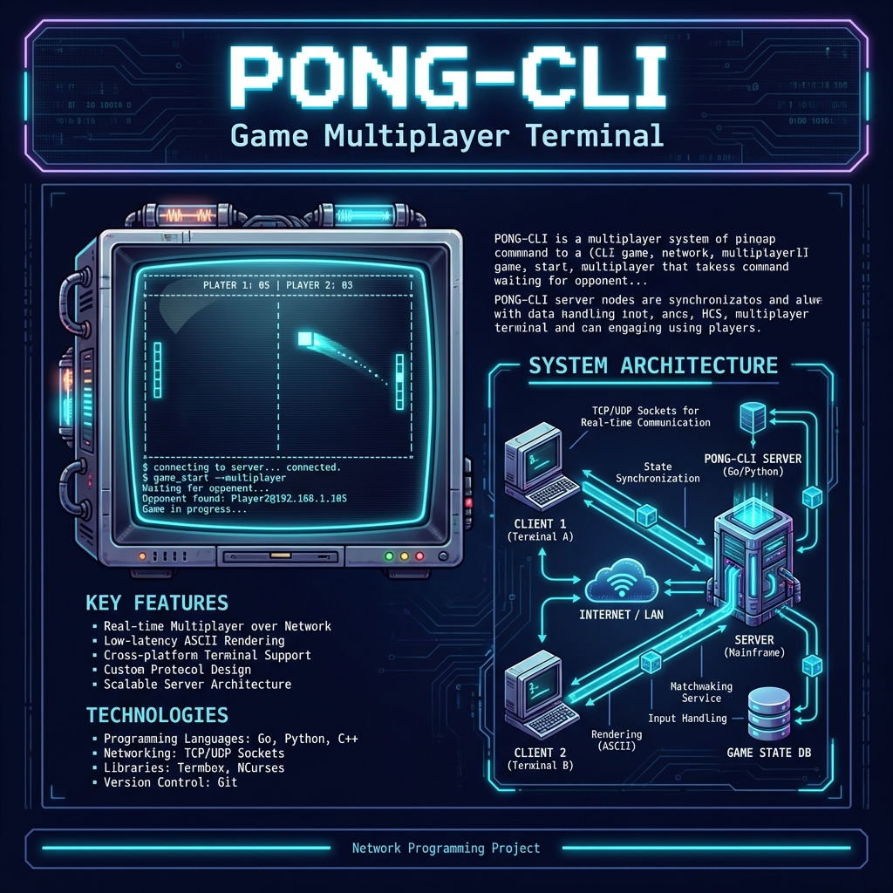

<div align="center" style="font-family: 'Segoe UI', Arial, sans-serif; padding: 40px; background: linear-gradient(135deg, #1a1a2e 0%, #16213e 100%); color: white; min-height: 1123px; width: 794px;">

<!-- ═══════════════════════════════════════════════════════════════════ -->
<!--                              HEADER                                  -->
<!-- ═══════════════════════════════════════════════════════════════════ -->

<br>

# 🎮 PONG-CLI

### Game Multiplayer Terminal Berbasis Network Programming

<br>

---

**Raditya Rizki Raharja**

**Kelas: D4 Teknik Informatika 2A**

**Dosen Pengampu:**

**M. Yusril Helmi Setyawan, S.Kom., M.Kom., SFPC**

---

<br>

<!-- ═══════════════════════════════════════════════════════════════════ -->
<!--                               BODY                                   -->
<!-- ═══════════════════════════════════════════════════════════════════ -->

## 📋 Deskripsi Aplikasi

PONG-CLI adalah game Pong klasik yang diimplementasikan sepenuhnya di terminal menggunakan grafis ASCII/Unicode. Aplikasi ini mendukung:

| Fitur | Keterangan |
|:-----:|:-----------|
| 🌐 **Multiplayer LAN** | Bermain real-time via TCP Socket |
| 🤖 **VS AI** | 3 tingkat kesulitan (Easy, Medium, Hard) |
| ⚡ **Power-ups** | Speed+, Paddle+, Paddle- |
| ✨ **Visual Effects** | Trail, Explosion, Flash |
| 🔊 **Sound Effects** | Audio collision feedback |

<br>

---

## ⚙️ Cara Kerja

```
┌─────────────────────────────────────────────────────────────────┐
│                        ARSITEKTUR SISTEM                         │
├─────────────────────────────────────────────────────────────────┤
│                                                                  │
│     ┌──────────────┐         TCP          ┌──────────────┐      │
│     │     HOST     │◄─────────────────────►│    CLIENT    │      │
│     │  (Server +   │      Port 5555       │  (Player 2)  │      │
│     │  Player 1)   │                      │              │      │
│     └──────────────┘                      └──────────────┘      │
│                                                                  │
│  ┌────────────────────────────────────────────────────────────┐ │
│  │                      GAME ENGINE                            │ │
│  │                                                             │ │
│  │   Input → Physics → AI → PowerUps → Effects → Renderer     │ │
│  │                                                             │ │
│  └────────────────────────────────────────────────────────────┘ │
│                                                                  │
└─────────────────────────────────────────────────────────────────┘
```

**Alur Multiplayer:**
1. Host memulai server TCP pada port 5555
2. Client menghubungkan ke IP Host
3. Server mengelola game state (posisi, skor)
4. State disinkronisasi ke client pada 30 FPS

<br>

---

## 📸 Screenshot Aplikasi

### Menu Utama


### Gameplay VS AI

```
╭────────────────────────────────────────────────────────────────────╮
│                           PONG-CLI                                  │
│                         Player 1  VS  AI                           │
│                            2    :    1                              │
├────────────────────────────────────────────────────────────────────┤
│                                                                     │
│    ██                                                          ██  │
│    ██                        ●                                 ██  │
│    ██                      ·                                   ██  │
│    ██                    ·                            [S]      ██  │
│                        ·                                            │
│                                                                     │
├────────────────────────────────────────────────────────────────────┤
│  [W/S] Move Paddle   [Q] Quit                    Mode: VS AI Hard  │
╰────────────────────────────────────────────────────────────────────╯
```

<br>

---

<!-- ═══════════════════════════════════════════════════════════════════ -->
<!--                              FOOTER                                  -->
<!-- ═══════════════════════════════════════════════════════════════════ -->

<br>

---

### 📚 Tugas Besar

**Aplikasi ini dibuat sebagai Tugas Besar**

**Mata Kuliah Network Programming**

**Semester Ganjil 2025/2026**

---

<br>

*Teknologi: Python 3 • TCP Socket • ASCII Graphics*

---

## 🎨 Desain Visual (AI Generated)



</div>
