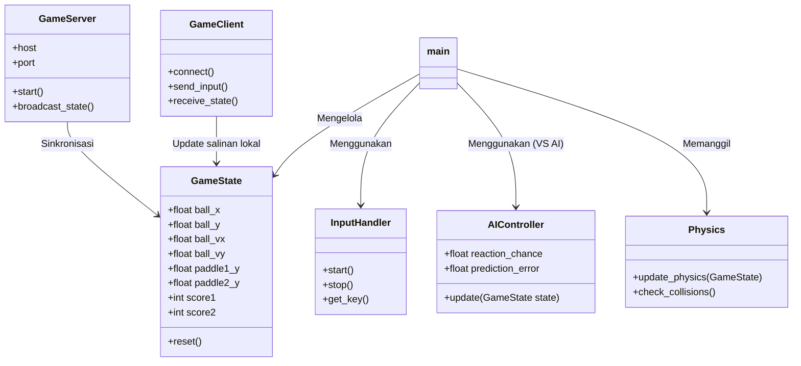
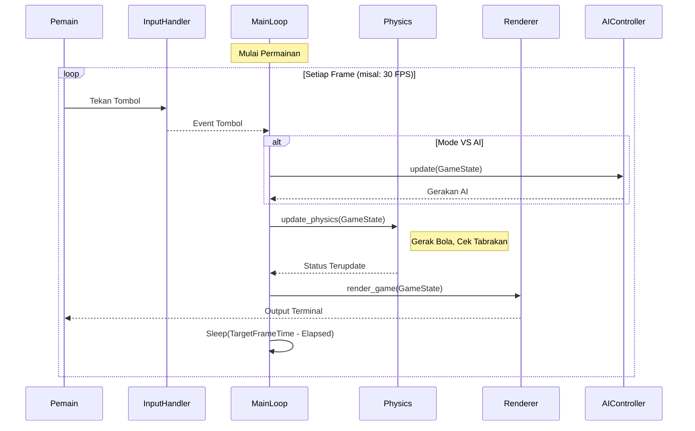

# Arsitektur Sistem

## 1. Ringkasan Eksekutif

Dokumen ini memberikan gambaran teknis mengenai arsitektur sistem PONG-CLI. Aplikasi ini adalah permainan Pong berbasis terminal yang mendukung mode pemain tunggal (Lawan AI) dan multipemain (LAN/Localhost). Sistem ini dibangun menggunakan Python 3 dan memanfaatkan pustaka standar untuk threading, jaringan, dan manipulasi terminal.

## 2. Arsitektur Tingkat Tinggi

Sistem mengikuti arsitektur modular yang memisahkan tanggung jawab antara jaringan, logika permainan, penanganan input, dan perenderan (rendering).

### 2.1 Komponen Inti

- **Game Engine**: Mengelola status permainan, perhitungan fisika, dan aturan main.
- **Networking Layer**: Menangani koneksi soket TCP untuk sinkronisasi multipemain.
- **Input System**: Menangkap input keyboard secara asinkron dengan cara yang aman (thread-safe).
- **Renderer**: Menggambar status permainan ke terminal menggunakan kode escape ANSI.
- **AI Module**: Menyediakan logika untuk lawan komputer pada mode pemain tunggal.

### 2.2 Struktur Direktori

| Modul | Deskripsi |
| :--- | :--- |
| `main.py` | Titik masuk (entry point), sistem menu, dan orkestrasi loop permainan. |
| `game_state.py` | Mendefinisikan struktur data untuk status permainan (bola, raket, skor). |
| `physics.py` | Logika inti permainan dan algoritma deteksi tabrakan. |
| `renderer.py` | Menangani output terminal dan penggambaran UI. |
| `input_handler.py` | Manajemen input keyboard lintas platform. |
| `server.py` | Implementasi Server TCP untuk hosting permainan. |
| `client.py` | Implementasi Client TCP untuk bergabung ke permainan. |
| `ai.py` | Logika Kecerdasan Buatan (AI) untuk mode pemain tunggal. |

## 3. Struktur Kelas

Diagram kelas berikut mengilustrasikan hubungan antara komponen utama sistem.

## 4. Alur Eksekusi (Game Loop)

Permainan beroperasi pada loop "fixed time-step" untuk memastikan konsistensi fisika di berbagai kecepatan mesin.

