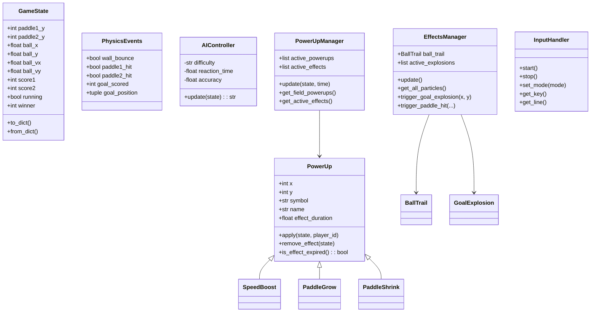
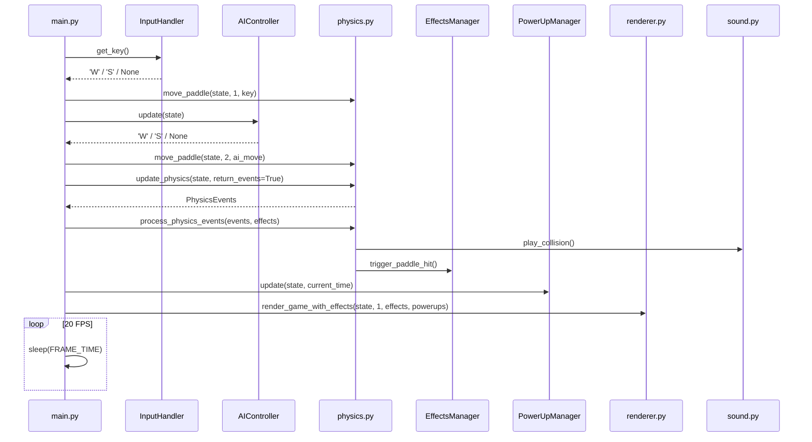
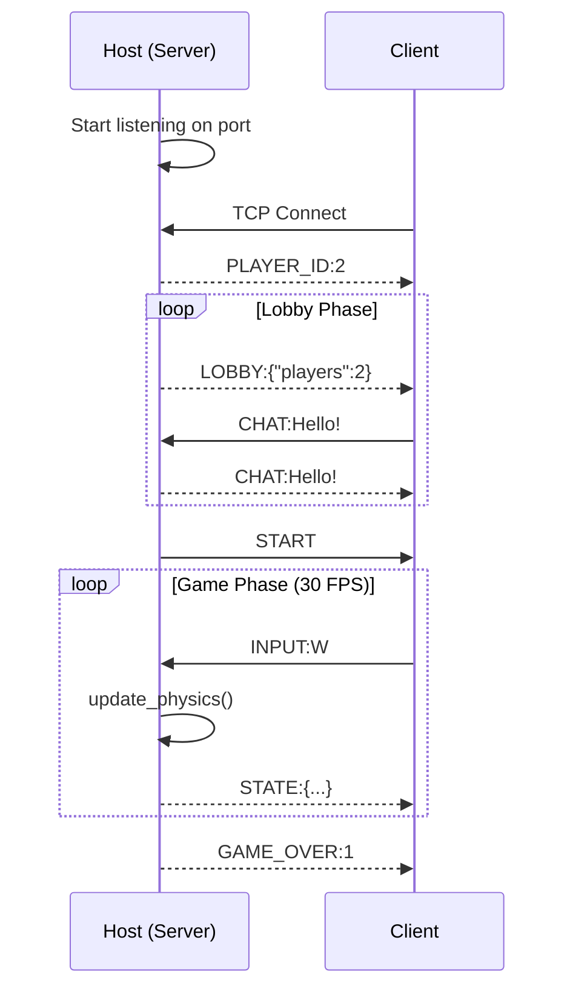
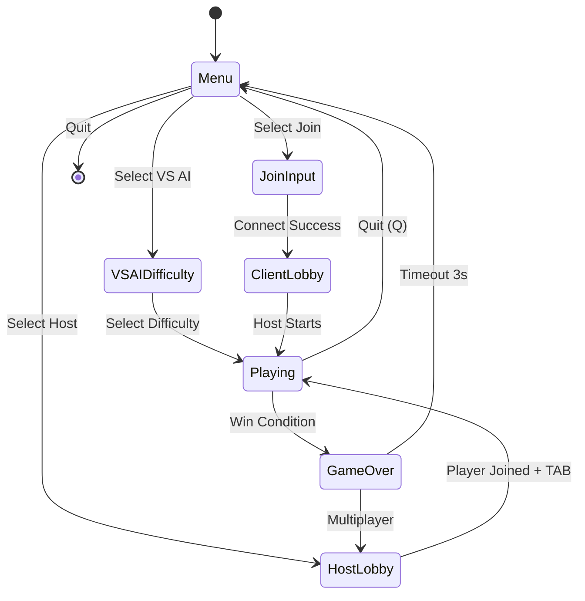

# Arsitektur Sistem

## Overview

PONG-CLI adalah aplikasi game terminal yang menggunakan arsitektur **Client-Server** untuk mode multiplayer dan **Single-Process** untuk mode VS AI.

```
┌────────────────────────────────────────────────────────────┐
│                      PONG-CLI                              │
├────────────────────────────────────────────────────────────┤
│  ┌─────────────┐  ┌─────────────┐  ┌─────────────────────┐ │
│  │   VS AI     │  │    Host     │  │       Join          │ │
│  │ Single Proc │  │   Server    │  │      Client         │ │
│  └──────┬──────┘  └──────┬──────┘  └──────────┬──────────┘ │
│         │                │                     │           │
│         ▼                ▼                     ▼           │
│  ┌─────────────────────────────────────────────────────┐  │
│  │                   Game Engine                       │  │
│  │  ┌─────────┐ ┌─────────┐ ┌─────────┐ ┌──────────┐  │  │
│  │  │GameState│ │ Physics │ │Renderer │ │  Input   │  │  │
│  │  └─────────┘ └─────────┘ └─────────┘ └──────────┘  │  │
│  └─────────────────────────────────────────────────────┘  │
│                                                            │
│  ┌─────────────────────────────────────────────────────┐  │
│  │                   Extensions                         │  │
│  │  ┌─────────┐ ┌─────────┐ ┌─────────┐ ┌──────────┐  │  │
│  │  │   AI    │ │PowerUps │ │ Effects │ │  Sound   │  │  │
│  │  └─────────┘ └─────────┘ └─────────┘ └──────────┘  │  │
│  └─────────────────────────────────────────────────────┘  │
└────────────────────────────────────────────────────────────┘
```

---

## Class Diagram



---

## Sequence Diagram: VS AI Game Loop



---

## Sequence Diagram: Multiplayer Flow



---

## State Diagram: Game States



---

## Data Flow

```
┌──────────────────────────────────────────────────────────┐
│                      INPUT LAYER                         │
│  ┌────────────────┐  ┌────────────────┐                 │
│  │ Keyboard Input │  │ Network Input  │                 │
│  │ (InputHandler) │  │ (Client recv)  │                 │
│  └───────┬────────┘  └───────┬────────┘                 │
└──────────┼───────────────────┼──────────────────────────┘
           │                   │
           ▼                   ▼
┌──────────────────────────────────────────────────────────┐
│                     LOGIC LAYER                          │
│  ┌─────────┐  ┌─────────┐  ┌─────────┐  ┌─────────┐    │
│  │ Physics │  │   AI    │  │PowerUps │  │ Effects │    │
│  └────┬────┘  └────┬────┘  └────┬────┘  └────┬────┘    │
│       │            │            │            │          │
│       └────────────┴────────────┴────────────┘          │
│                         │                               │
│                         ▼                               │
│                   ┌───────────┐                         │
│                   │ GameState │                         │
│                   └─────┬─────┘                         │
└─────────────────────────┼───────────────────────────────┘
                          │
                          ▼
┌──────────────────────────────────────────────────────────┐
│                     OUTPUT LAYER                         │
│  ┌────────────────┐  ┌────────────────┐  ┌──────────┐  │
│  │    Renderer    │  │ Network Send   │  │  Sound   │  │
│  │   (Terminal)   │  │ (Server send)  │  │  Player  │  │
│  └────────────────┘  └────────────────┘  └──────────┘  │
└──────────────────────────────────────────────────────────┘
```

---

## Modul Dependencies

```
main.py
├── config.py
├── colors.py
├── ui_components.py (uses pyfiglet)
├── input_handler.py
├── game_state.py
├── physics.py
│   └── sound.py
├── renderer.py
│   ├── colors.py
│   └── ui_components.py
├── ai.py
├── powerups.py
├── effects.py
├── server.py
│   ├── game_state.py
│   └── physics.py
└── client.py
    └── game_state.py
```

---

## Network Protocol Details

### TCP Connection
- **Port**: 5555 (configurable)
- **Buffer Size**: 2048 bytes
- **Encoding**: UTF-8
- **Delimiter**: Newline (`\n`)

### Message Format
```
TYPE:DATA\n
```

### State Serialization
```json
{
    "paddle1_y": 8,
    "paddle2_y": 8,
    "ball_x": 30.5,
    "ball_y": 10.2,
    "ball_vx": 1.5,
    "ball_vy": -1.0,
    "score1": 2,
    "score2": 1,
    "running": true,
    "winner": 0
}
```

---

## Performance Considerations

| Component | Target | Actual |
|-----------|--------|--------|
| Frame Rate | 20 FPS | ~20 FPS |
| Network Latency | <50ms | LAN: ~5ms |
| Input Latency | <16ms | ~10ms |
| Render Time | <10ms | ~5ms |

---

*Dokumentasi ini di-generate berdasarkan implementasi aktual.*
