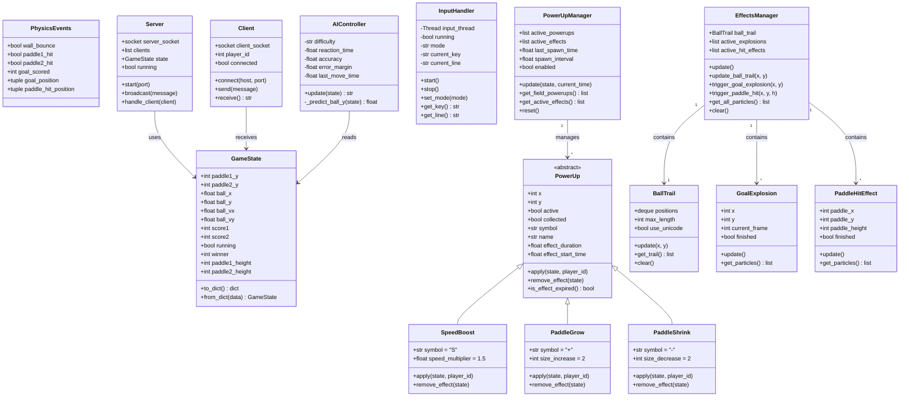

# Class Diagram

Diagram ini menunjukkan struktur class dan hubungan antar komponen dalam PONG-CLI.

## Penjelasan

### Core Classes
- **GameState**: Menyimpan seluruh state permainan (posisi, skor, dll)
- **PhysicsEvents**: Container untuk event yang terjadi saat physics update

### AI Module
- **AIController**: Mengontrol paddle AI dengan berbagai tingkat kesulitan

### Power-ups Module
- **PowerUp**: Base class untuk semua power-up
- **SpeedBoost**: Mempercepat bola (simbol: S)
- **PaddleGrow**: Memperbesar paddle (simbol: +)
- **PaddleShrink**: Memperkecil paddle lawan (simbol: -)
- **PowerUpManager**: Mengelola spawn dan efek power-up

### Effects Module
- **BallTrail**: Efek jejak bola
- **GoalExplosion**: Animasi ledakan saat gol
- **PaddleHitEffect**: Efek kilat saat paddle memukul bola
- **EffectsManager**: Mengelola semua efek visual

### Network Classes
- **Server**: TCP server untuk mode multiplayer
- **Client**: TCP client untuk join game
