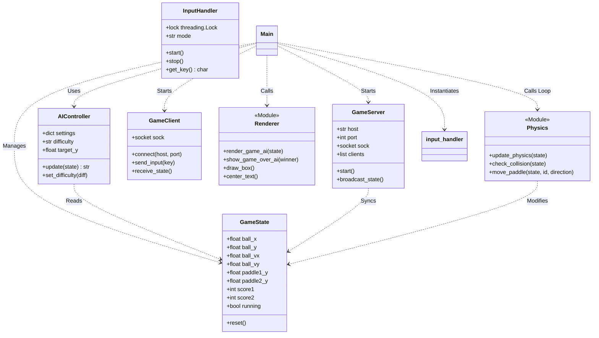

# Visualisasi Class Diagram Program

## Deskripsi
Class Diagram ini memetakan struktur statis dari perangkat lunak, menunjukkan kelas-kelas utama, atribut penting, metode-metode kunci, dan hubungan antar mereka.
- **GameState**: Kelas pusat yang meyimpan data permainan. Diakses oleh hampir semua modul lain.
- **AIController**: Kelas yang membungkus logika keputusan lawan komputer.
- **GameServer/GameClient**: Kelas-kelas yang menangani komunikasi jaringan TCP.
- **InputHandler**: Kelas utilitas untuk abstraksi input keyboard.
- **Physics**: Bukan kelas (modul fungsional), tetapi digambarkan untuk menunjukkan tanggung jawab logika fisika.

## Diagram Mermaid

