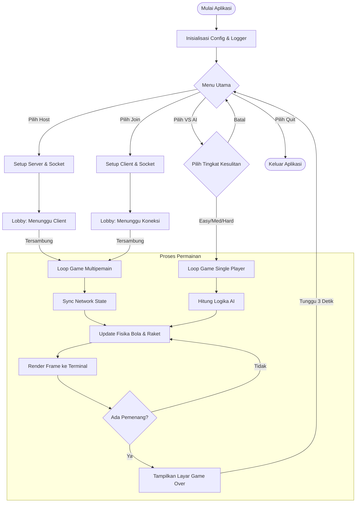

# Visualisasi Flowchart Program

## Deskripsi
Diagram alir (flowchart) di bawah ini menggambarkan alur eksekusi utama dari aplikasi PONG-CLI. Dimulai dari inisialisasi aplikasi, pengguna masuk ke **Menu Utama** di mana mereka memiliki tiga pilihan mode permainan utama:
1.  **Host Game**: Menjadikan komputer sebagai server untuk permainan multipemain.
2.  **Join Game**: Menghubungkan komputer sebagai klien ke server yang sudah ada.
3.  **VS AI**: Bermain melawan komputer (Single Player) dengan pilihan tingkat kesulitan.

Setelah permainan selesai (Game Over), alur akan kembali ke Menu Utama, memungkinkan pengguna untuk memulai permainan baru atau keluar dari aplikasi.

## Flowchart

