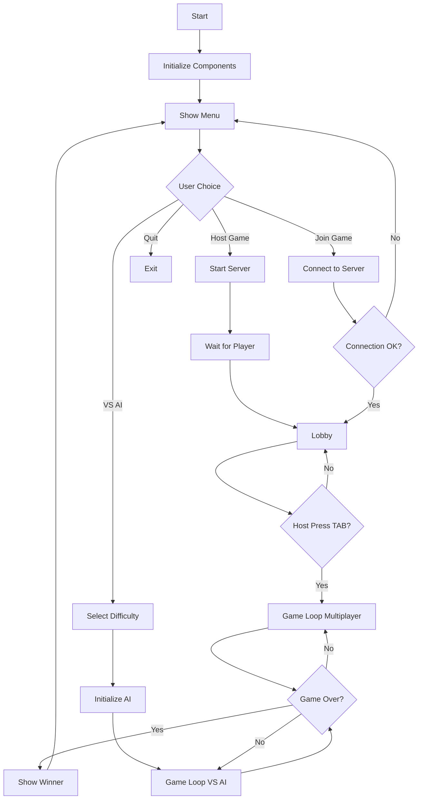
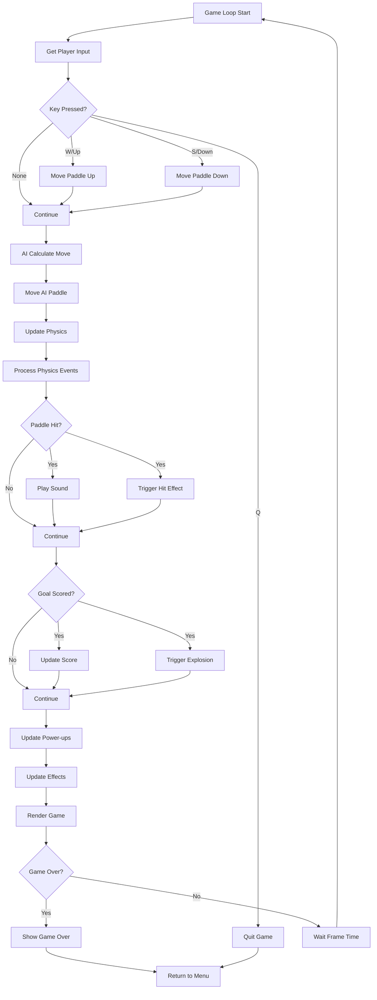
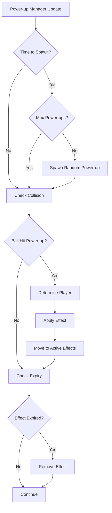
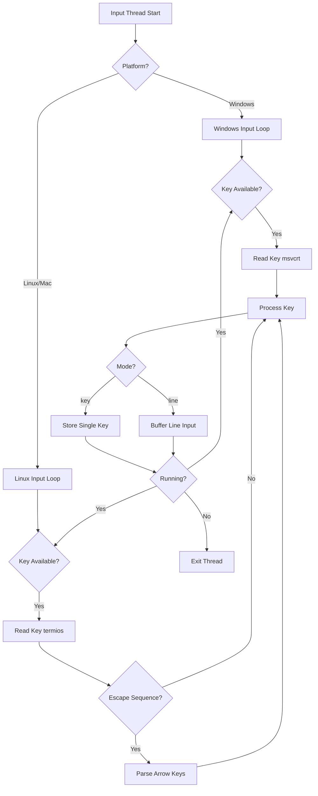
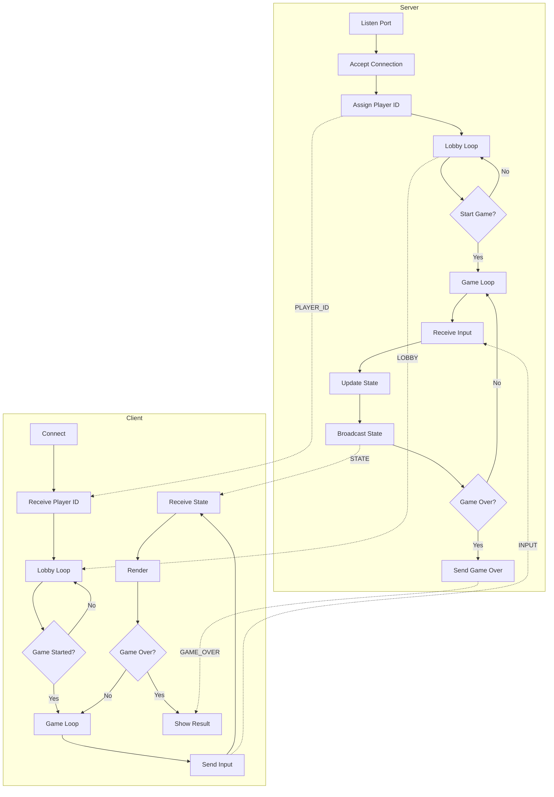

# Flowchart

Diagram alur utama aplikasi PONG-CLI.

## Main Application Flow

```mermaid
flowchart TD
    A[Start] --> B[Initialize Components]
    B --> C[Show Menu]
    
    C --> D{User Choice}
    D -->|Host Game| E[Start Server]
    D -->|Join Game| F[Connect to Server]
    D -->|VS AI| G[Select Difficulty]
    D -->|Quit| Z[Exit]
    
    E --> H[Wait for Player]
    H --> I[Lobby]
    
    F --> J{Connection OK?}
    J -->|Yes| I
    J -->|No| C
    
    G --> K[Initialize AI]
    K --> L[Game Loop VS AI]
    
    I --> M{Host Press TAB?}
    M -->|Yes| N[Game Loop Multiplayer]
    M -->|No| I
    
    L --> O{Game Over?}
    N --> O
    
    O -->|Yes| P[Show Winner]
    O -->|No| L
    O -->|No| N
    
    P --> C
    
    Z[Exit]
```

## Game Loop Flow (VS AI)

```mermaid
flowchart TD
    A[Game Loop Start] --> B[Get Player Input]
    B --> C{Key Pressed?}
    
    C -->|W/Up| D[Move Paddle Up]
    C -->|S/Down| E[Move Paddle Down]
    C -->|Q| Z[Quit Game]
    C -->|None| F[Continue]
    
    D --> F
    E --> F
    
    F --> G[AI Calculate Move]
    G --> H[Move AI Paddle]
    
    H --> I[Update Physics]
    I --> J[Process Physics Events]
    
    J --> K{Paddle Hit?}
    K -->|Yes| L[Play Sound]
    K -->|Yes| M[Trigger Hit Effect]
    K -->|No| N[Continue]
    
    L --> N
    M --> N
    
    N --> O{Goal Scored?}
    O -->|Yes| P[Update Score]
    O -->|Yes| Q[Trigger Explosion]
    O -->|No| R[Continue]
    
    P --> R
    Q --> R
    
    R --> S[Update Power-ups]
    S --> T[Update Effects]
    T --> U[Render Game]
    
    U --> V{Game Over?}
    V -->|Yes| W[Show Game Over]
    V -->|No| X[Wait Frame Time]
    X --> A
    
    W --> Y[Return to Menu]
    Z --> Y
```

## Power-up Flow

```mermaid
flowchart TD
    A[Power-up Manager Update] --> B{Time to Spawn?}
    
    B -->|Yes| C{Max Power-ups?}
    B -->|No| D[Check Collision]
    
    C -->|No| E[Spawn Random Power-up]
    C -->|Yes| D
    
    E --> D
    
    D --> F{Ball Hit Power-up?}
    F -->|Yes| G[Determine Player]
    F -->|No| H[Check Expiry]
    
    G --> I[Apply Effect]
    I --> J[Move to Active Effects]
    J --> H
    
    H --> K{Effect Expired?}
    K -->|Yes| L[Remove Effect]
    K -->|No| M[Continue]
    
    L --> M
```

## Input Handler Flow

```mermaid
flowchart TD
    A[Input Thread Start] --> B{Platform?}
    
    B -->|Windows| C[Windows Input Loop]
    B -->|Linux/Mac| D[Linux Input Loop]
    
    C --> E{Key Available?}
    D --> F{Key Available?}
    
    E -->|Yes| G[Read Key msvcrt]
    F -->|Yes| H[Read Key termios]
    
    G --> I[Process Key]
    H --> J{Escape Sequence?}
    
    J -->|Yes| K[Parse Arrow Keys]
    J -->|No| I
    
    K --> I
    
    I --> L{Mode?}
    L -->|key| M[Store Single Key]
    L -->|line| N[Buffer Line Input]
    
    M --> O{Running?}
    N --> O
    
    O -->|Yes| E
    O -->|Yes| F
    O -->|No| P[Exit Thread]
```

## Network Communication Flow

```mermaid
flowchart TD
    subgraph Server
        A[Listen Port] --> B[Accept Connection]
        B --> C[Assign Player ID]
        C --> D[Lobby Loop]
        D --> E{Start Game?}
        E -->|Yes| F[Game Loop]
        E -->|No| D
        F --> G[Receive Input]
        G --> H[Update State]
        H --> I[Broadcast State]
        I --> J{Game Over?}
        J -->|Yes| K[Send Game Over]
        J -->|No| F
    end
    
    subgraph Client
        L[Connect] --> M[Receive Player ID]
        M --> N[Lobby Loop]
        N --> O{Game Started?}
        O -->|Yes| P[Game Loop]
        O -->|No| N
        P --> Q[Send Input]
        Q --> R[Receive State]
        R --> S[Render]
        S --> T{Game Over?}
        T -->|Yes| U[Show Result]
        T -->|No| P
    end
    
    C -.->|PLAYER_ID| M
    D -.->|LOBBY| N
    I -.->|STATE| R
    Q -.->|INPUT| G
    K -.->|GAME_OVER| U
```
