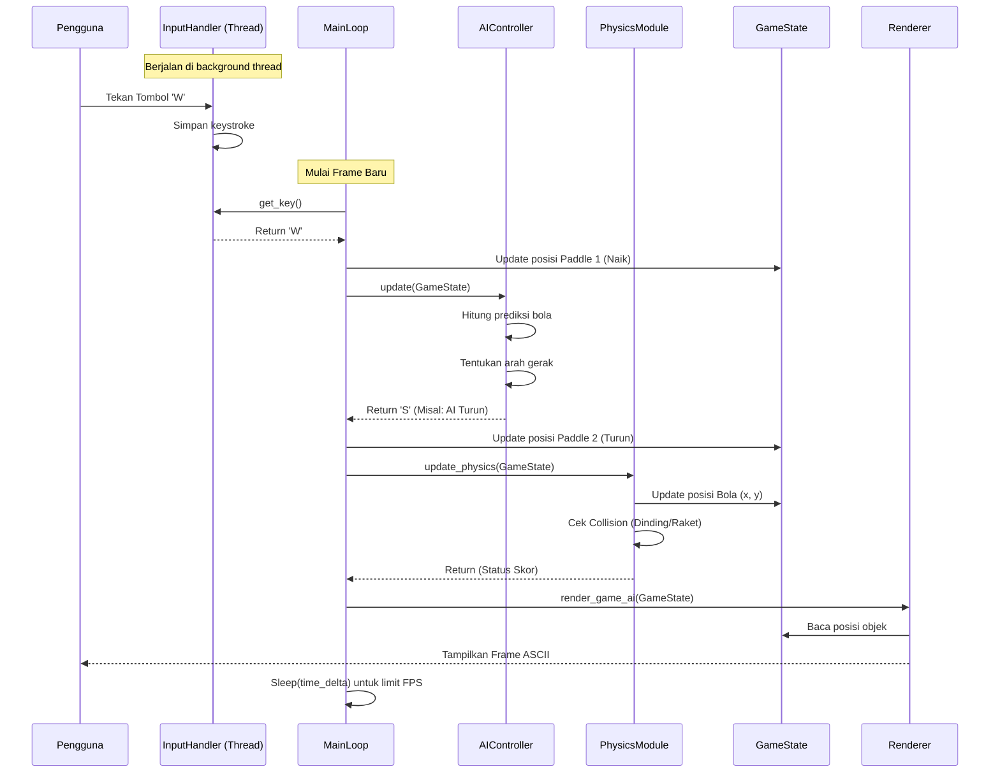

# Visualisasi Sequence Diagram Program

## Deskripsi
Sequence Diagram berikut mendetailkan interaksi yang terjadi dalam **satu frame** permainan (Single Player VS AI). Ini menunjukkan bagaimana InputHandler menangkap tombol, MainLoop mengorkestrasi logika, AI membuat keputusan, Physics menghitung pergerakan, dan Renderer menggambar hasilnya ke layar.

Alur ini berulang terus-menerus selama permainan berjalan (status `Running`).

## Sequence Diagram

