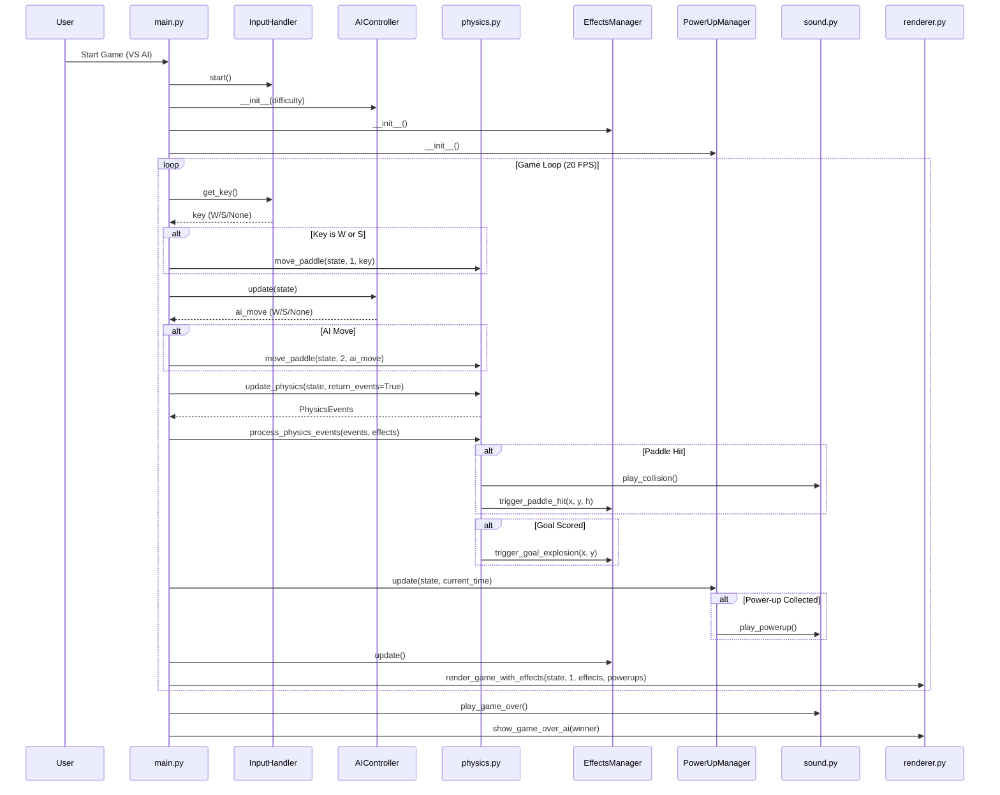
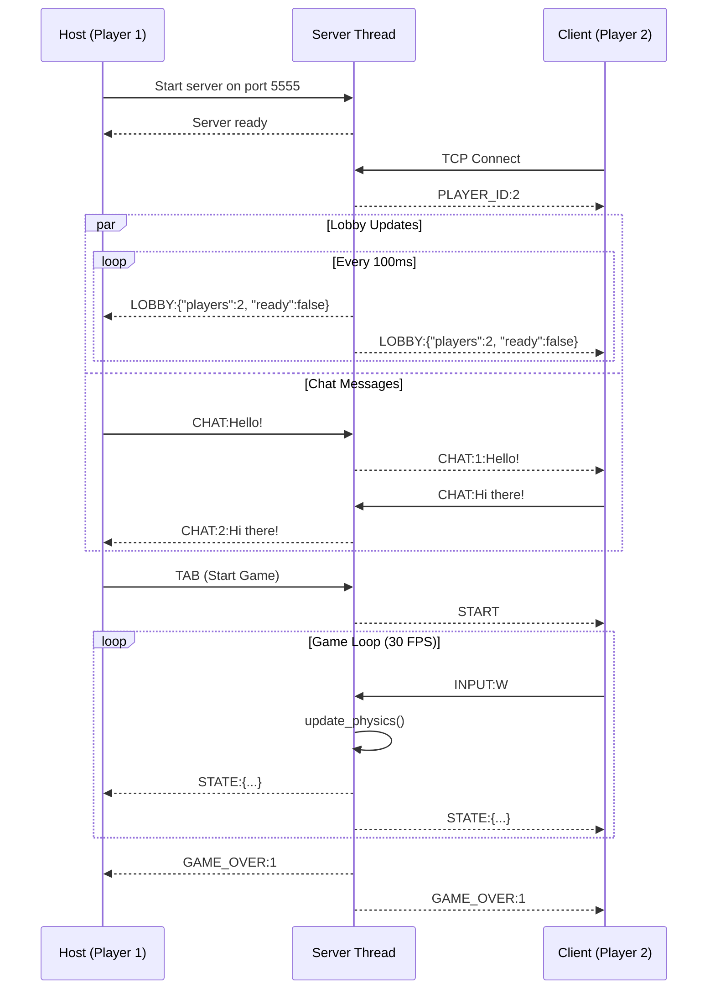
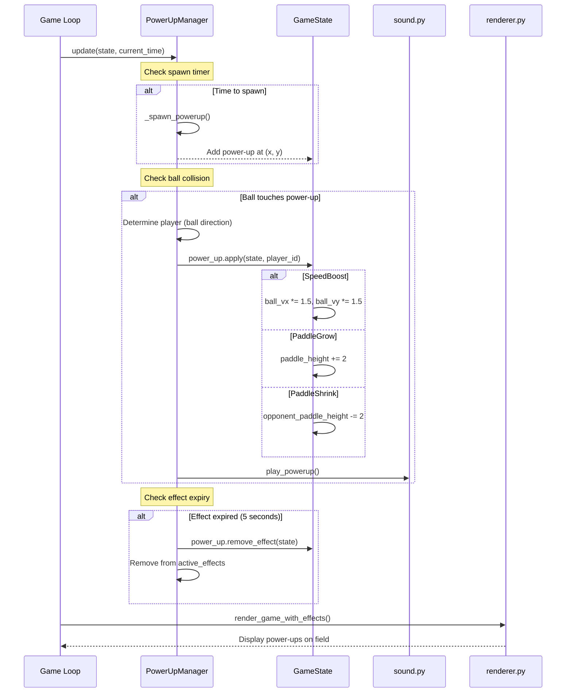
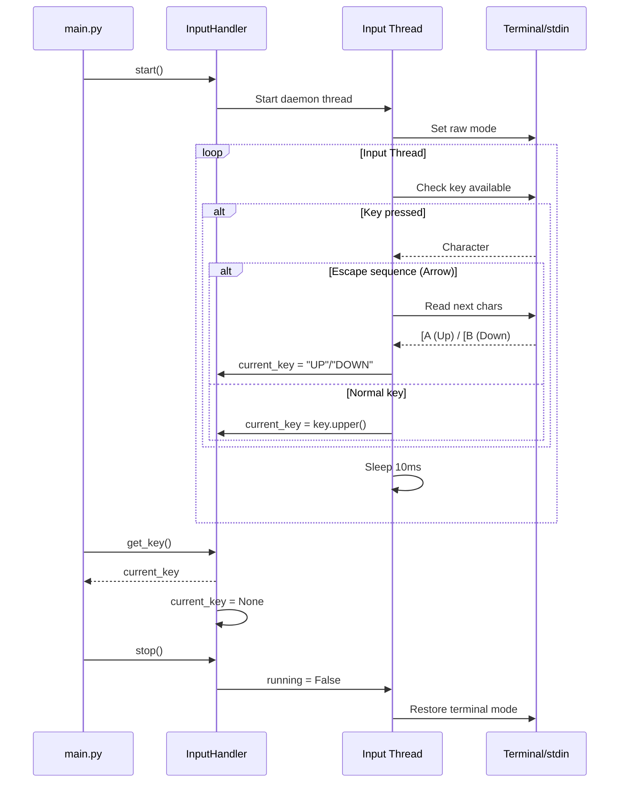

# Sequence Diagram

Diagram urutan interaksi antar komponen dalam PONG-CLI.

## VS AI Game Flow

```mermaid
sequenceDiagram
    participant User
    participant Main as main.py
    participant Input as InputHandler
    participant AI as AIController
    participant Physics as physics.py
    participant Effects as EffectsManager
    participant PowerUps as PowerUpManager
    participant Sound as sound.py
    participant Renderer as renderer.py
    
    User->>Main: Start Game (VS AI)
    Main->>Input: start()
    Main->>AI: __init__(difficulty)
    Main->>Effects: __init__()
    Main->>PowerUps: __init__()
    
    loop Game Loop (20 FPS)
        Main->>Input: get_key()
        Input-->>Main: key (W/S/None)
        
        alt Key is W or S
            Main->>Physics: move_paddle(state, 1, key)
        end
        
        Main->>AI: update(state)
        AI-->>Main: ai_move (W/S/None)
        
        alt AI Move
            Main->>Physics: move_paddle(state, 2, ai_move)
        end
        
        Main->>Physics: update_physics(state, return_events=True)
        Physics-->>Main: PhysicsEvents
        
        Main->>Physics: process_physics_events(events, effects)
        
        alt Paddle Hit
            Physics->>Sound: play_collision()
            Physics->>Effects: trigger_paddle_hit(x, y, h)
        end
        
        alt Goal Scored
            Physics->>Effects: trigger_goal_explosion(x, y)
        end
        
        Main->>PowerUps: update(state, current_time)
        
        alt Power-up Collected
            PowerUps->>Sound: play_powerup()
        end
        
        Main->>Effects: update()
        Main->>Renderer: render_game_with_effects(state, 1, effects, powerups)
    end
    
    Main->>Sound: play_game_over()
    Main->>Renderer: show_game_over_ai(winner)
```

## Multiplayer Connection Flow

```mermaid
sequenceDiagram
    participant Host as Host (Player 1)
    participant Server as Server Thread
    participant Client as Client (Player 2)
    
    Host->>Server: Start server on port 5555
    Server-->>Host: Server ready
    
    Client->>Server: TCP Connect
    Server-->>Client: PLAYER_ID:2
    
    par Lobby Updates
        loop Every 100ms
            Server-->>Host: LOBBY:{"players":2, "ready":false}
            Server-->>Client: LOBBY:{"players":2, "ready":false}
        end
    and Chat Messages
        Host->>Server: CHAT:Hello!
        Server-->>Client: CHAT:1:Hello!
        Client->>Server: CHAT:Hi there!
        Server-->>Host: CHAT:2:Hi there!
    end
    
    Host->>Server: TAB (Start Game)
    Server-->>Client: START
    
    loop Game Loop (30 FPS)
        Client->>Server: INPUT:W
        Server->>Server: update_physics()
        Server-->>Host: STATE:{...}
        Server-->>Client: STATE:{...}
    end
    
    Server-->>Host: GAME_OVER:1
    Server-->>Client: GAME_OVER:1
```

## Power-up Collection Flow

```mermaid
sequenceDiagram
    participant GameLoop as Game Loop
    participant PowerUps as PowerUpManager
    participant State as GameState
    participant Sound as sound.py
    participant Renderer as renderer.py
    
    GameLoop->>PowerUps: update(state, current_time)
    
    Note over PowerUps: Check spawn timer
    
    alt Time to spawn
        PowerUps->>PowerUps: _spawn_powerup()
        PowerUps-->>State: Add power-up at (x, y)
    end
    
    Note over PowerUps: Check ball collision
    
    alt Ball touches power-up
        PowerUps->>PowerUps: Determine player (ball direction)
        PowerUps->>State: power_up.apply(state, player_id)
        
        alt SpeedBoost
            State->>State: ball_vx *= 1.5, ball_vy *= 1.5
        else PaddleGrow
            State->>State: paddle_height += 2
        else PaddleShrink
            State->>State: opponent_paddle_height -= 2
        end
        
        PowerUps->>Sound: play_powerup()
    end
    
    Note over PowerUps: Check effect expiry
    
    alt Effect expired (5 seconds)
        PowerUps->>State: power_up.remove_effect(state)
        PowerUps->>PowerUps: Remove from active_effects
    end
    
    GameLoop->>Renderer: render_game_with_effects()
    Renderer-->>GameLoop: Display power-ups on field
```

## Input Handler Flow

```mermaid
sequenceDiagram
    participant Main as main.py
    participant Handler as InputHandler
    participant Thread as Input Thread
    participant Terminal as Terminal/stdin
    
    Main->>Handler: start()
    Handler->>Thread: Start daemon thread
    Thread->>Terminal: Set raw mode
    
    loop Input Thread
        Thread->>Terminal: Check key available
        
        alt Key pressed
            Terminal-->>Thread: Character
            
            alt Escape sequence (Arrow)
                Thread->>Terminal: Read next chars
                Terminal-->>Thread: [A (Up) / [B (Down)
                Thread->>Handler: current_key = "UP"/"DOWN"
            else Normal key
                Thread->>Handler: current_key = key.upper()
            end
        end
        
        Thread->>Thread: Sleep 10ms
    end
    
    Main->>Handler: get_key()
    Handler-->>Main: current_key
    Handler->>Handler: current_key = None
    
    Main->>Handler: stop()
    Handler->>Thread: running = False
    Thread->>Terminal: Restore terminal mode
```
