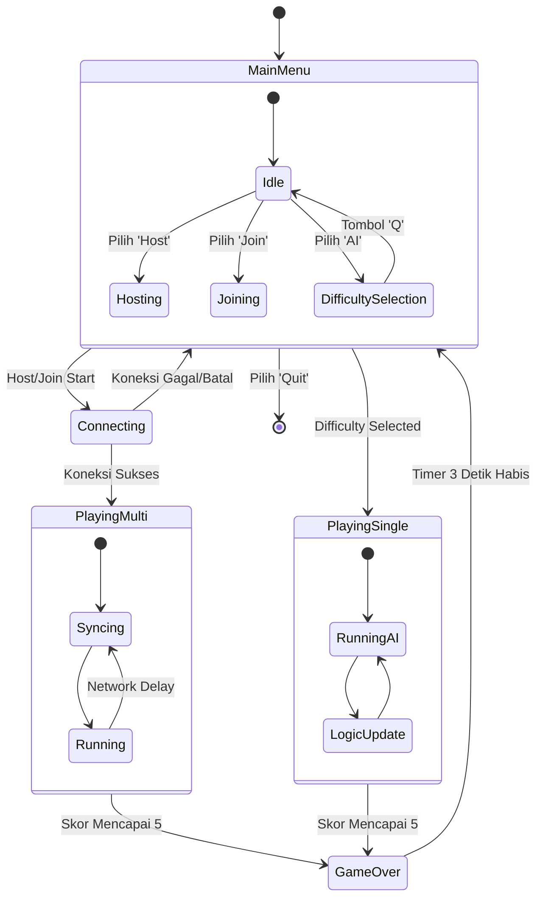

# Visualisasi State Diagram Program

## Deskripsi
State Diagram ini memodelkan status-status yang mungkin terjadi dalam aplikasi dan transisi apa yang memicu perpindahan status tersebut.
- **MainMenu**: Status awal saat aplikasi dibuka.
- **DiffSelect**: Sub-menu untuk memilih kesulitan AI.
- **Connecting**: Proses negosiasi socket untuk multipemain.
- **Playing**: Status utama saat permainan berlangsung.
- **Paused**: Status sementara (jika implementasi pause ada atau saat menunggu sinkronisasi).
- **GameOver**: Status akhir permainan sebelum kembali ke menu.

## State Diagram

