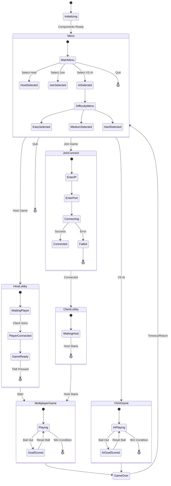
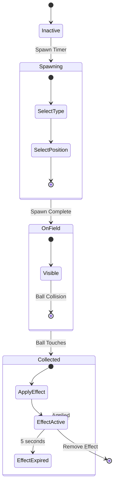
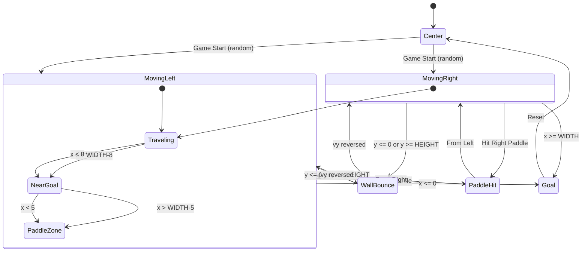
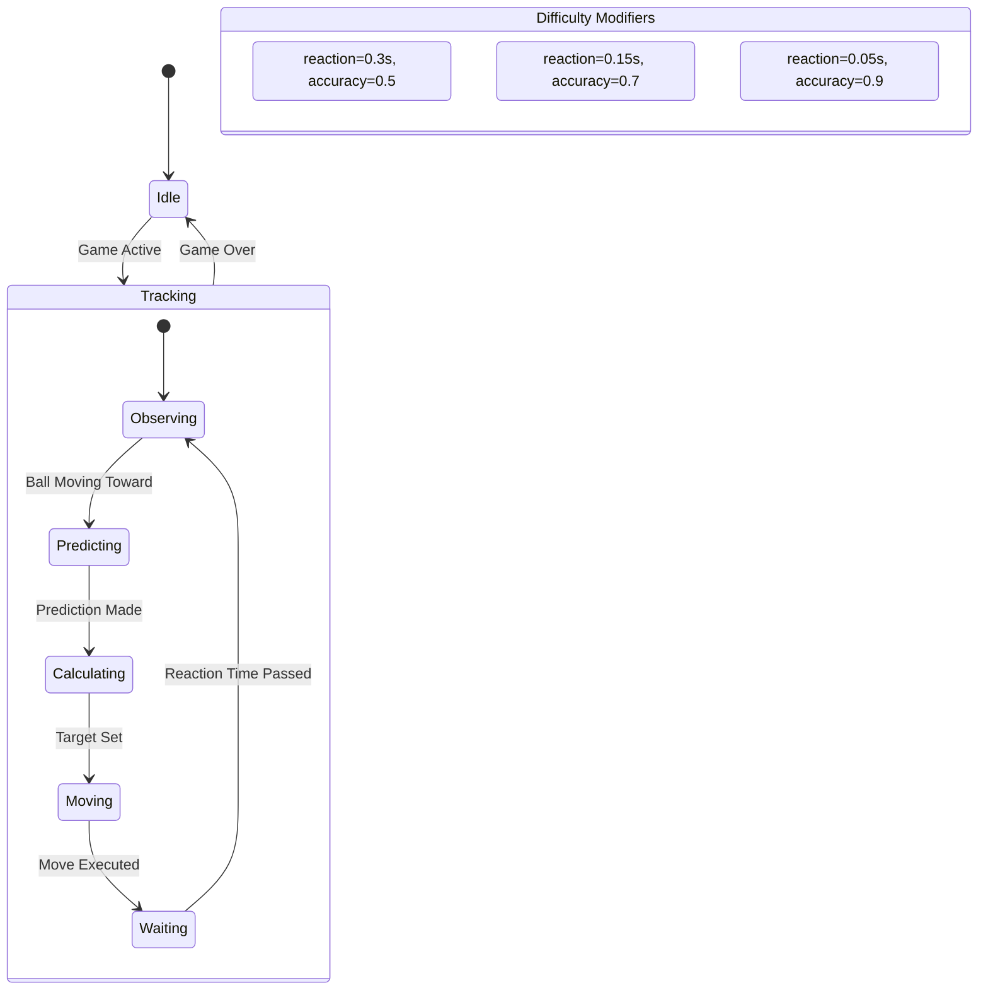
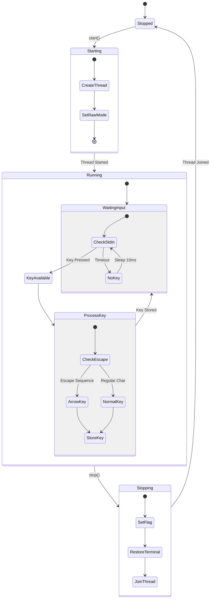
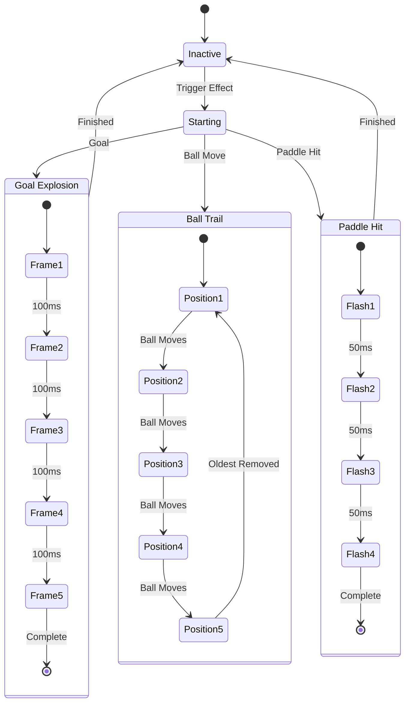

# State Diagram

Diagram state untuk berbagai komponen dalam PONG-CLI.

## Application States

## Power-up States

## Ball States

## AI Controller States

## Input Handler States

## Effect Animation States

